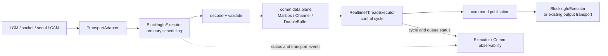

# 阻塞 I/O 执行器扩展设计

## 概述

本文提出 `BlockingIoExecutor` 扩展，用于把 LCM、socket、串口、CAN、文件描述符等
**专属、事件驱动、允许有限阻塞**的接收循环纳入 `executor` 的注册、生命周期和观测
体系。

它补齐当前项目的第三种执行模型：

| 模型 | 当前类型 | 适合的工作 | 不适合的工作 |
| --- | --- | --- | --- |
| 通用异步 | `ThreadPoolExecutor` | 有限的离散任务、并行计算、后台工作 | 永久占用 worker 的收包循环 |
| 周期实时 | `RealtimeThreadExecutor` | 固定周期、短且有预算的控制和发布回调 | 阻塞 I/O、未知耗时的协议解码 |
| 阻塞 I/O | `BlockingIoExecutor`，本设计新增 | 专属接收、事件等待、有限 timeout、可唤醒退出 | 控制决策、长计算、通用任务调度 |

`std::jthread` 是 `BlockingIoExecutor` 的建议内部实现，不是公开的并发模型。
应用不应自行维护未注册的 `jthread`，否则 Executor 无法统一启动、停止、统计和诊断。

## 背景和问题

`RealtimeThreadExecutor` 的实际契约是：每个周期依次执行 `cycle_callback`、有限消费
内部队列、记录周期耗时，再以绝对时间睡眠。周期回调中的任何阻塞都会直接计入
`cycle_timeout_count`，并触发 skip-late 调相。因此把 `lcm.handleTimeout()` 一类调用
放入该回调，会把网络或驱动抖动传递到控制周期。

普通线程池也不是合适替代。将永不返回的 `while` 循环提交到线程池会永久占用一个
worker，使 `wait_for_completion()`、负载均衡、任务超时和队列指标不再表达其原本语义。
即使专门创建单 worker 线程池，也无法表达 transport 的唤醒、收包活性和协议错误。

当前 `ExecutorManager` 管理默认异步、实时和 GPU 执行器；`executor::comm` 已提供
有界 channel、`LatestMailbox`、`RealtimeChannel`、`DoubleBuffer` 和独立 `CommStats`。
新模型必须复用这些边界，不能把通信错误混入普通 task exception，也不能破坏实时路径。

## 目标

1. 将专属、可阻塞 I/O worker 纳入 `ExecutorManager` 的命名、所有权、RAII 和 shutdown。
2. 让 `stop()` 有明确且可验证的退出机制：请求停止后必须解除底层阻塞并 join。
3. 保证接收和解码不占用 `SCHED_FIFO` 控制线程；默认使用普通 OS 调度。
4. 为 transport 提供面向运行状态的可观测性，并与 `executor::comm` 的数据面统计协作。
5. 保持现有 async、RT、GPU API 的兼容性；新增独立接口，不把 I/O 伪装成实时任务或线程池任务。
6. 允许 LCM、POSIX fd、串口和 CAN 先以适配器接入，后续可扩展其他协议而不改变 executor 核心语义。

## 非目标

- 不实现完整的 reactor/actor/Rx 框架，不在第一版提供多路 fd 聚合器。
- 不保证端到端硬实时性，也不因“尽快收包”默认提升到 `SCHED_FIFO`。
- 不把所有通信对象自动注册到 Executor 的 failure 面；通信背压、陈旧数据和协议错误有独立语义。
- 不承诺仅靠 `std::stop_token` 可以取消第三方库的阻塞调用。
- 不改变 `LatestMailbox<T>`、`RealtimeChannel<T>` 当前的锁实现。硬实时消费者须根据对象、复制成本和锁竞争单独评估，不能从类型名推导无锁保证。

## 总体架构



接收 worker 只做 I/O、边界检查、解码和向数据面发布；它不得直接执行业务控制。
控制回调只读取已准备好的状态快照，生成命令。需要逐条保留的消息走有界 channel；只需要
最新状态的数据走 mailbox 或快照。这个分层避免网络抖动侵入控制周期。

## API 与类型设计

### 配置与状态

建议新增到 `include/executor/config.hpp`：

```cpp
struct BlockingIoConfig {
    std::string thread_name;
    std::vector<int> cpu_affinity;       // 空表示由 OS 调度，不自动绑核。
    bool enable_memory_lock = false;     // 默认关闭；仅测量后显式启用。
    std::chrono::milliseconds startup_timeout{1000};
};
```

建议新增到 `include/executor/types.hpp`：

```cpp
enum class BlockingIoStopReason {
    None,
    Requested,
    WorkerReturned,
    TransportError,
    StartupFailed
};

struct BlockingIoExecutorStatus {
    std::string name;
    bool is_running = false;
    bool stop_requested = false;
    bool ready = false;
    bool cpu_affinity_applied = false;
    bool memory_locked = false;
    uint64_t wakeup_count = 0;
    uint64_t poll_count = 0;
    uint64_t received_count = 0;
    uint64_t decoded_count = 0;
    uint64_t decode_error_count = 0;
    uint64_t transport_error_count = 0;
    std::chrono::steady_clock::time_point last_receive_time{};
    std::chrono::steady_clock::time_point last_success_time{};
    BlockingIoStopReason stop_reason = BlockingIoStopReason::None;
    std::string last_error_message;
};
```

这些计数是 worker/transport 生命周期指标；队列深度、覆盖、消费者延迟等仍属于
`CommStats`。避免把两类数混合为一个无法解释的“丢包率”。

### Transport 契约

建议新增 `include/executor/blocking_io.hpp`，定义 transport 与执行器之间的窄接口：

```cpp
class IBlockingIoWorker {
public:
    virtual ~IBlockingIoWorker() = default;

    // 在 executor 创建的专属线程调用。必须在有限时间内响应 stop_token。
    virtual void run(std::stop_token stop_token) = 0;

    // 必须解除 run() 当前的阻塞等待；可重复调用，且不得抛出。
    virtual void wakeup() noexcept = 0;

    // 可选：在 run() 进入事件循环且 transport 可用后调用一次。
    virtual void on_started() noexcept {}
};

class IBlockingIoExecutor {
public:
    virtual ~IBlockingIoExecutor() = default;
    virtual bool start() = 0;
    virtual void request_stop() noexcept = 0;
    virtual void stop() = 0;  // request_stop + wakeup + join
    virtual std::string get_name() const = 0;
    virtual BlockingIoExecutorStatus get_status() const = 0;
};
```

`run()` 返回不等于正常关闭：执行器应把未请求停止时的返回记录为 `WorkerReturned`，并将
未捕获异常记录为 `TransportError`。`wakeup()` 是强制契约。仅检查 `stop_token` 不足以
唤醒 `read()`、`poll()`、`handleTimeout()` 或第三方库的无限等待。

第一版不提供 `push_task()`：I/O worker 是一个拥有 transport 的长期服务，不是任务队列。
控制平面的配置更新应通过已有 `executor::comm` 对象或 worker 自己的受控配置接口传递。

### Facade 与管理器

在 `ExecutorManager` 中增加独立注册表和锁：

```cpp
bool register_blocking_io_executor(
    const std::string& name,
    std::unique_ptr<IBlockingIoExecutor> executor);
IBlockingIoExecutor* get_blocking_io_executor(const std::string& name);
std::vector<std::string> get_blocking_io_executor_names() const;
```

在 `Executor` facade 提供和 RT 对称的生命周期接口：

```cpp
ExecutorResult register_blocking_io_worker_ex(
    const std::string& name,
    const BlockingIoConfig& config,
    std::unique_ptr<IBlockingIoWorker> worker);
bool register_blocking_io_worker(...);  // 兼容风格的 bool 包装

ExecutorResult start_blocking_io_worker_ex(const std::string& name);
bool start_blocking_io_worker(const std::string& name);
void stop_blocking_io_worker(const std::string& name);
BlockingIoExecutorStatus get_blocking_io_worker_status(
    const std::string& name) const;
```

名称必须在同一个 `Executor` 实例内跨 RT、GPU、I/O 统一唯一，防止监控、日志和 shutdown
依赖歧义。若现有各注册表无法立即改为共享 name registry，第一版至少应在 facade 注册时做
跨表冲突检查，并在后续版本收敛到统一 registry。

注册/启动失败继续复用 `ExecutorResult` 和现有 `ExecutorErrorCode`：非法 worker/config
使用 `InvalidConfig`，重名使用 `DuplicateName`，不存在使用 `NotFound`，线程或 transport
初始化失败使用 `StartFailed`。不新增“看似成功但后台稍后失败”的启动语义：worker 应在
`startup_timeout` 内报告 ready；超时则返回失败并完成清理。

## 线程与停止语义

### 内部实现

`BlockingIoExecutor` 持有 `std::jthread`、状态原子变量和 worker 所有权。启动时在线程内设置
线程名、可选 affinity 和可选 memory lock，再调用 `worker->run(stop_token)`。第一版不暴露
nice/priority 调整：Linux 的 nice 可能影响整个进程，必须先有目标设备测量和更精确的平台语义。
线程创建失败必须回滚 `is_running`，与 `RealtimeThreadExecutor::start()` 的失败回滚一致。

`request_stop()` 的固定顺序：

```text
stop_requested = true
-> jthread.request_stop()
-> worker.wakeup()
```

`stop()` 调用 `request_stop()` 后 join。析构函数也必须走同一路径。不能在未成功 join 时
detach：worker 仍可访问已析构的 transport、mailbox 或 Executor，detach 会把明确的停止问题
变成 use-after-free 风险。

停止时间上限来自 worker 的 interruptibility，而不是 executor 的 join timeout。若第三方库
无法 wakeup，适配器必须使用有限 timeout；例如 `handleTimeout(5)` 至多约 5 ms 后回到循环
检查 stop token。更优实现是 poll transport fd 和 wakeup fd，从而接近即时退出。

### LCM 适配器

LCM worker 应优先使用 LCM 暴露的底层文件描述符，并与 Linux `eventfd`（或平台等价的
自唤醒机制）一起等待：

```text
poll(lcm_fd, wakeup_fd)
  lcm_fd readable    -> handleTimeout(0) drain available messages
  wakeup_fd readable -> consume wakeup token, inspect stop_token, exit
```

若目标 LCM 版本不提供 fd，则使用 `handleTimeout(bounded_timeout)`；每次返回后检查
`stop_token`。无限阻塞的 `handle()` 不满足本设计，注册时应拒绝没有 `wakeup()` 和有限等待
保证的适配器。LCM 回调内只做轻量反序列化、校验和发布；复杂规划或磁盘记录改投线程池。

socket、串口与 CAN 适配器遵循同一模式：非阻塞 fd + poll/epoll 或有限 driver timeout，配合
eventfd/pipe/CancelIoEx 等平台中断。平台相关 wakeup 放在 transport adapter，不泄漏进 executor
公共 API。

## 与通信能力的关系

### 数据面选择

| 输入/输出语义 | 推荐组件 | I/O worker 行为 | RT 消费约束 |
| --- | --- | --- | --- |
| 机器人状态、定位、目标值，只需新鲜值 | `LatestMailbox<T>` 或 `DoubleBuffer<T>` | 覆盖旧快照并记录 overwrite | 周期读取并检查 sequence/age；当前实现有 mutex，硬 RT 需使用经测量的专用快照实现 |
| 诊断、日志、每条事件都要保留 | `MpscChannel<T>` | 有界 `try_send`，按策略处理满队列 | 不在 RT 中无限 drain；必要时由普通工作线程消费 |
| RT 周期内有限处理的命令 | `RealtimeChannel<T>` | 非 RT 生产者发送 | 仅 `drain_for_cycle`，明确 `max_items_per_cycle` |
| 配置、启停、重连控制 | `LatestMailbox<T>`、`PhaseGate` | 发布新配置或推进阶段 | 只在安全周期边界采用新配置 |

对于状态流，允许丢弃旧状态通常比积压更安全；必须显式定义 max age，RT 回调在状态陈旧时进入
业务定义的降级/安全模式。对于命令流，不能默认用 `KeepLatest`，因为这会丢失命令序列语义。

I/O worker 本身的 `received_count` 不是业务消息成功率：内核、LCM transport 和应用解码可在
不同位置丢弃数据。告警至少需要组合 `BlockingIoExecutorStatus`、对应 `CommStats` 与状态年龄。

### 诊断与失败面

保留现有边界：通信事件默认不计入 `ExecutorFailureStatus`，也不伪装成
`FailureKind::TaskException`。建议新增独立 `BlockingIoEvent` 或复用 `CommEventCallback` 记录：

- transport 断开、重连、poll 错误、decode error；
- worker 非预期返回、启动超时和 wakeup 失败；
- 消息覆盖、队列满、陈旧状态和超过延迟阈值。

仅影响 executor 生命周期的失败，例如 worker 启动失败或无法创建线程，才通过 facade 的
`ExecutorResult` 与 `SubmitRejected` 风格诊断呈现。运行期 transport 故障应留在 I/O/通信事件
域，应用可按阈值桥接到自身告警系统。高频收包、覆盖和错误不得默认每次写日志或分配字符串。

## 生命周期、关闭和其他执行器

### 启动顺序

默认建议：创建通信数据面 -> 注册 I/O worker -> 启动 I/O worker 并等待 ready -> 启动 RT 控制
循环 -> 启动周期后台任务。这样控制回调从第一周期开始就能区分“无状态”和“状态陈旧”。
`PhaseGate` 可显式表达传感器 ready、标定完成和控制允许输出等业务阶段；Executor 不应根据名称
猜测依赖关系。

### 关闭顺序

现有 `Executor::shutdown()` 先停止 timer thread，`ExecutorManager::shutdown()` 当前再停止 RT、GPU
和默认 async。接入 I/O 后不能仅在 map 锁内逐个 join，因为 worker 的回调或状态查询可能回调
进入 Executor，容易形成锁级反转。

建议 Manager 的通用关闭流程为：

```text
1. Facade 停止 delayed/periodic timer，阻止新的后台生产者。
2. 应用执行自身的安全停机动作：停止执行器外部输出、让控制进入安全状态。
3. Manager 在不持有 registry 锁时，对全部 I/O worker request_stop + wakeup。
4. 在不持有 registry 锁时 join 全部 I/O worker；随后从 registry 移除。
5. 停止并 join RT executor。
6. 停止 GPU executor 和默认 async executor，沿用现有 wait_for_tasks 语义。
```

第 2 步不能由通用库替应用决定。例如某设备需要先发一帧安全命令，另一些设备要求先停接收再
断开。建议将其作为应用显式 `prepare_shutdown()`；不要让 Executor 用“停止 RT 前/后”这种隐式
顺序承担设备安全策略。

`shutdown(false)` 仍必须对 I/O worker 执行 `request_stop + wakeup + join`，因为保留后台线程
会破坏对象生命周期。这里的 false 只适用于 async/GPU 队列的未完成工作，不适用于已拥有资源的
专属 I/O 线程。`atexit` 仅是兜底；安全关键应用必须显式执行有序 shutdown。

## 调度、资源和优先级

- I/O 默认 `SCHED_OTHER`/普通优先级，不因周期短自动提升 priority，也不默认 memory lock。
- 可选 affinity 用于隔离 IRQ、网络处理或繁忙核，但默认不绑核，避免与 RT 控制核争用。
- 若部署确有接收延迟上限，先测量 IRQ affinity、socket 缓冲、队列深度、解码耗时和 RT deadline；
  只有在证据支持时，才允许应用为 I/O 提升普通优先级。第一版不暴露 FIFO 配置。
- worker `run()` 内不得调用长时间同步 RPC、磁盘 I/O、动态内存密集的批量处理或普通 mutex 链。
  这些工作应以有界数据提交给 async/GPU executor。
- 传输回调不得阻塞等待 RT 消费者。满队列策略、降采样和丢弃规则必须在协议接入层显式定义。

## 异常、重连和所有权

worker 捕获自身可恢复的 I/O 错误，更新状态并按配置退避重连；不可恢复错误从 `run()` 抛出或返回
明确信号，由 `BlockingIoExecutor` 记录并转换为 stopped 状态。第一版不自动重启 worker，避免
在 transport 仍被外部占用时产生重启风暴；自动重连属于 adapter，自动重启属于后续明确配置的
supervisor 功能。

`IBlockingIoWorker`、transport 和它发布到的数据面对象的所有权必须清晰：executor 拥有 worker，
worker 持有 transport，应用持有或与 worker 共享通信对象，并保证其生命周期至少覆盖 `stop()`
返回。不得让 worker 捕获栈引用；不得在其回调中销毁自己所属 executor。

## 兼容性与迁移

现有 `std::jthread` LCM 接收实现可以按以下路径迁移：

1. 保持当前业务数据结构与 mailbox/channel 不变，抽出 `LcmWorker`，实现 `run()` 和 `wakeup()`。
2. 先使用有限 `handleTimeout()` 验证 request-stop/join 和状态计数；添加 LCM fd 后再优化 wakeup 延迟。
3. 将 jthread 的创建、异常捕获、命名和 join 移入 `BlockingIoExecutor`；业务层改用 facade 注册/启动。
4. 接入 `CommStats`、状态年龄和 transport event 告警；删除重复的应用级线程生命周期代码。
5. 在设备环境测量启动、稳定收包、过载、断链、重连和 shutdown，再考虑 affinity 调优。

此变更新增 API，不改变 `register_realtime_task()`、`submit()` 或现有通信组件的 ABI/语义。RT 回调
若此前直接调用 `poll_state()`，应改为读取 I/O worker 发布的状态；这是刻意的行为调整，需通过
集成测试验证状态新鲜度与安全降级策略。

## 验证计划

### 单元测试

- 注册参数、空名、空 worker、重名、跨类型重名和重复启动的 `ExecutorResult`。
- 线程创建失败时状态回滚；worker 在 ready 前返回或抛异常时启动失败。
- `request_stop()` 与 `stop()` 幂等；多线程同时 stop 不双重 wakeup/join。
- `wakeup()` 被调用后，受控阻塞 worker 在规定测试时间内退出并 join。
- worker 异常、非预期返回、decode error 和 transport error 的状态累计与最近事件。
- Manager shutdown 不在 registry 锁内调用 worker callback/join；析构路径无泄漏。

### 通信与集成测试

- I/O worker 向 `LatestMailbox`/`MpscChannel` 发布，验证 sequence、覆盖、容量和统计。
- RT 控制回调读取最新可用状态；无初始状态、陈旧状态、解码失败时进入预期业务降级。
- 高生产速率下验证状态流不无限积压，命令流不意外使用覆盖语义。
- LCM/socket 模拟器验证有限 timeout 与 wakeup fd 两条路径；断链和重连不阻塞 shutdown。
- 与周期 timer、RT、GPU、async 同时运行时执行反复启动/停止压力测试。

### 性能与部署验证

- 记录 receive-to-publish、publish-to-control-read、状态年龄、RT cycle timeout、队列深度和 CPU 占用。
- 对比独立 jthread 与 `BlockingIoExecutor` 的吞吐、尾部延迟和 shutdown 延迟，确认管理层不引入额外热路径分配或锁竞争。
- 在目标 Linux 权限、cpuset、IRQ affinity 和实际 NIC/CAN/serial 设备上验证；CI 结果不能替代硬件部署测量。
- 使用 TSAN 验证生命周期和通信对象无数据竞争；使用 ASAN/LSAN 验证异常启动、停止和重连路径的资源释放。

## 未来扩展

第一版以“一 worker 对应一 transport/thread”为边界。只有出现大量低负载 fd、线程数成为明确瓶颈
且测量证据充分时，再添加 `IoReactorExecutor`：一个普通优先级 reactor 管理多个 fd，并保持每个
adapter 的独立状态和背压统计。它不能替代 `BlockingIoExecutor` 的接口，二者应共享 transport 和
可观测性契约，而不是强迫所有协议切换模型。

在实现前，应先确定目标 LCM 版本是否能取得 fd、部署平台的 wakeup 原语，以及每类消息的丢弃和
陈旧数据策略；这些是 transport 适配与业务安全契约，不应由通用 executor 默认猜测。
