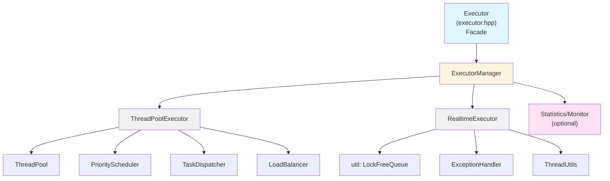

# Executor C++ 项目设计方案

本文档基于 [Executor 工具项目架构设计](executor.md)，给出 C++ 具体实现的项目结构、模块划分、构建系统及实现顺序。

---

## 1. 项目概览

| 项目属性 | 说明 |
|----------|------|
| **项目名称** | executor |
| **语言标准** | C++20 |
| **构建系统** | CMake 3.16+ |
| **产出物** | 静态库 `libexecutor.a`、动态库 `libexecutor.so`（可选）、头文件 |
| **依赖** | C++ 标准库（`std::thread`、`std::atomic`、`std::shared_mutex` 等），无第三方必需依赖 |

---

## 2. 目录结构

```
executor/
├── CMakeLists.txt              # 根 CMake 配置
├── cmake/                      # CMake 模块
│   ├── CompilerWarnings.cmake
│   ├── Sanitizers.cmake
│   └── ExecutorConfig.cmake
├── include/
│   └── executor/               # 对外公开头文件（安装时暴露）
│       ├── executor.hpp        # Facade：主 API
│       ├── config.hpp          # ExecutorConfig, ThreadPoolConfig, RealtimeThreadConfig
│       ├── interfaces.hpp      # IAsyncExecutor, IRealtimeExecutor, ICycleManager
│       ├── types.hpp           # AsyncExecutorStatus, RealtimeExecutorStatus, Task 等
│       └── executor_manager.hpp
├── src/                        # 实现（内部使用，可不安装）
│   ├── executor/
│   │   ├── executor.cpp
│   │   ├── executor_manager.cpp
│   │   ├── thread_pool_executor.cpp
│   │   ├── realtime_thread_executor.cpp
│   │   ├── thread_pool/
│   │   │   ├── thread_pool.cpp
│   │   │   ├── priority_scheduler.cpp
│   │   │   ├── task_dispatcher.cpp
│   │   │   └── load_balancer.cpp
│   │   ├── task/
│   │   │   ├── task.cpp
│   │   │   └── task_dependency_manager.cpp
│   │   ├── util/
│   │   │   ├── lockfree_queue.hpp     # 无锁队列（头文件实现）
│   │   │   ├── thread_utils.cpp       # 优先级、CPU 亲和性
│   │   │   └── exception_handler.cpp
│   │   └── monitor/
│   │       ├── task_monitor.cpp
│   │       └── statistics_collector.cpp
│   └── executor.cpp            # 库入口（可选）
├── tests/
│   ├── CMakeLists.txt
│   ├── test_executor.cpp
│   ├── test_thread_pool.cpp
│   ├── test_realtime_executor.cpp
│   ├── test_priority_scheduler.cpp
│   └── test_task_dependency.cpp
├── examples/
│   ├── CMakeLists.txt
│   ├── basic_submit.cpp
│   ├── realtime_can.cpp
│   └── multi_project.cpp
└── docs/
    └── design/
        ├── executor.md
        └── cpp-project-design.md
```

---

## 3. 模块划分与职责

### 3.1 模块依赖关系（自底向上）



### 3.2 各模块说明

| 模块 | 路径 | 职责 | 对外接口 |
|------|------|------|----------|
| **Executor** | `include/executor/executor.hpp` | Facade，统一任务提交、实时注册、监控查询 | `Executor::instance()`, `submit`, `register_realtime_task` 等 |
| **ExecutorManager** | `include/executor/executor_manager.hpp` | 管理默认异步执行器、注册/获取实时执行器、生命周期 | `initialize_async_executor`, `get_default_async_executor`, `register_realtime_executor` |
| **Interfaces** | `include/executor/interfaces.hpp` | `IAsyncExecutor`, `IRealtimeExecutor`, `ICycleManager` | 抽象接口 |
| **Config & Types** | `include/executor/config.hpp`, `types.hpp` | 配置结构体、状态结构体、`Task` 等 | 无逻辑 |
| **ThreadPoolExecutor** | `src/executor/thread_pool_executor.cpp` | 实现 `IAsyncExecutor`，封装 `ThreadPool` | 通过 `ExecutorManager` 暴露 |
| **RealtimeThreadExecutor** | `src/executor/realtime_thread_executor.cpp` | 实现 `IRealtimeExecutor`，专用线程 + 周期循环 | 通过 `ExecutorManager` 暴露 |
| **ThreadPool** | `src/executor/thread_pool/` | 线程池、优先级调度、任务分发、负载均衡 | 内部使用 |
| **Task** | `src/executor/task/` | 任务封装、依赖管理 | 内部使用 |
| **Util** | `src/executor/util/` | 无锁队列、异常处理、线程工具（优先级、亲和性） | 内部使用，部分头文件 |
| **Monitor** | `src/executor/monitor/` | 任务监控、统计收集（可选） | 通过 `Executor` 查询 API 暴露 |

---

## 4. 头文件与源文件分工

### 4.1 公开头文件（`include/executor/`）

- **executor.hpp**：`Executor` Facade，包含 `config.hpp`、`interfaces.hpp`、`types.hpp`、`executor_manager.hpp`，对外仅需 `#include <executor/executor.hpp>`。
- **config.hpp**：`ExecutorConfig`、`ThreadPoolConfig`、`RealtimeThreadConfig`、`ThreadPoolStatus` 等。
- **interfaces.hpp**：`IAsyncExecutor`、`IRealtimeExecutor`、`ICycleManager` 纯虚接口。
- **types.hpp**：`AsyncExecutorStatus`、`RealtimeExecutorStatus`、`Task`、`TaskPriority`、`TaskStatistics` 等。
- **executor_manager.hpp**：`ExecutorManager` 类声明。实现可放在 `src`，通过链接库使用。

### 4.2 内部实现（`src/executor/`）

- 所有 `.cpp` 实现对应模块逻辑。
- **lockfree_queue.hpp**：模板无锁队列，头文件实现，仅内部包含；若依赖 `boost::lockfree::queue` 可单独抽象适配层。

### 4.3 接口稳定性

- 仅 `include/executor/` 下头文件视为稳定 API，随版本保持兼容。
- `src/` 内实现可随意重构，只要不改变公开接口行为。

---

## 5. 构建系统（CMake）

### 5.1 根 `CMakeLists.txt` 要点

```cmake
cmake_minimum_required(VERSION 3.16)
project(executor LANGUAGES CXX VERSION 0.1.0)

set(CMAKE_CXX_STANDARD 20)
set(CMAKE_CXX_STANDARD_REQUIRED ON)

# 选项：构建类型、测试、示例、安装
option(EXECUTOR_BUILD_TESTS "Build tests" ON)
option(EXECUTOR_BUILD_EXAMPLES "Build examples" OFF)
option(EXECUTOR_BUILD_SHARED "Build shared library" OFF)

add_subdirectory(src)
if(EXECUTOR_BUILD_TESTS)
  add_subdirectory(tests)
endif()
if(EXECUTOR_BUILD_EXAMPLES)
  add_subdirectory(examples)
endif()

include(GNUInstallDirs)
install(TARGETS executor
  ARCHIVE DESTINATION ${CMAKE_INSTALL_LIBDIR}
  LIBRARY DESTINATION ${CMAKE_INSTALL_LIBDIR}
  RUNTIME DESTINATION ${CMAKE_INSTALL_BINDIR})
install(DIRECTORY include/ DESTINATION ${CMAKE_INSTALL_INCLUDEDIR})
```

### 5.2 `src/CMakeLists.txt` 要点

- 收集所有 `src/executor/**/*.cpp` 及必要的 `*.hpp`（若采用）。
- 用 `add_library(executor STATIC ...)` 或 `SHARED` 生成库。
- `target_include_directories(executor PUBLIC include PRIVATE ${CMAKE_CURRENT_SOURCE_DIR})`，保证编译与安装后 `#include <executor/...>` 可用。
- 仅链接 `pthread`（及平台相关库，若有）；不链接第三方库，除非可选组件依赖。

### 5.3 编译选项与质量

- 在 `cmake/CompilerWarnings.cmake` 中统一启用 `-Wall -Wextra`（及 MSVC 等价项）。
- 可选 `cmake/Sanitizers.cmake` 提供 `ASAN`/`UBSAN` 等，用于调试构建。

---

## 6. 依赖说明

### 6.1 标准库

- 线程与同步：`std::thread`、`std::mutex`、`std::condition_variable`、`std::shared_mutex`、`std::atomic`。
- 时间：`std::chrono`。
- 其他：`std::function`、`std::future`、`std::promise`、`std::queue`、`std::priority_queue`、`std::unordered_map`、`std::vector`、`std::string` 等。

### 6.2 可选依赖

- **无锁队列**：优先使用自实现简单 SPSC/MPSC 队列（见 `util/lockfree_queue.hpp`）；若后续需要更强保证，可引入 `boost::lockfree::queue` 并抽象为适配层，不暴露给 API。
- **周期管理**：设计中的 `ICycleManager` 为可选扩展点，默认不依赖外部实现。

### 6.3 平台相关

- Linux：`pthread`、`sched.h`（优先级）、`pthread_setaffinity_np`（亲和性）。
- Windows：`SetThreadPriority`、`SetThreadAffinityMask` 等，在 `thread_utils.cpp` 中抽象为统一接口，实现 `set_thread_priority`、`set_cpu_affinity`。

---

## 7. 实现顺序建议

按依赖自底向上实现，便于单元测试与集成。

| 阶段 | 模块 | 交付物 | 验证方式 |
|------|------|--------|----------|
| **1** | `util`: LockFreeQueue, ExceptionHandler, ThreadUtils | `lockfree_queue.hpp`, `exception_handler.cpp`, `thread_utils.cpp` | 单元测试 |
| **2** | `task`: Task, TaskDependencyManager | `task.cpp`, `task_dependency_manager.cpp` | 单元测试 |
| **3** | `thread_pool`: PriorityScheduler, 简单 ThreadPool（先不做动态扩缩容） | `priority_scheduler.cpp`, `thread_pool.cpp` | 单元测试 |
| **4** | ThreadPoolExecutor | `thread_pool_executor.cpp` 实现 `IAsyncExecutor` | 集成测试 |
| **5** | ExecutorManager + 默认异步执行器 | `executor_manager.cpp`，`initialize_async_executor`、`get_default_async_executor` | 集成测试 |
| **6** | RealtimeThreadExecutor | `realtime_thread_executor.cpp` 实现 `IRealtimeExecutor`，内置 `simple_cycle_loop` | 集成测试 |
| **7** | Executor Facade | `executor.cpp`，封装 `ExecutorManager`，提供 `submit`、`register_realtime_task` 等 | 示例运行 |
| **8** | LoadBalancer、动态扩缩容（可选） | 扩展 `thread_pool` | 性能/单元测试 |
| **9** | Monitor（TaskMonitor、StatisticsCollector） | `task_monitor.cpp`，`statistics_collector.cpp`，`enable_monitoring` | 可选，接口测试 |
| **10** | ICycleManager 集成（可选） | 在 `RealtimeThreadExecutor` 中支持注入 `cycle_manager` | 示例 + 单元测试 |

---

## 8. 关键类与文件映射

| 设计文档中的类/结构 | 所在文件 | 说明 |
|---------------------|----------|------|
| `IAsyncExecutor` | `interfaces.hpp` | 抽象接口 |
| `IRealtimeExecutor` | `interfaces.hpp` | 抽象接口 |
| `ICycleManager` | `interfaces.hpp` | 可选接口 |
| `AsyncExecutorStatus` | `types.hpp` | 结构体 |
| `RealtimeExecutorStatus` | `types.hpp` | 结构体 |
| `ExecutorConfig` | `config.hpp` | 含 ThreadPool 等配置 |
| `ThreadPoolConfig` | `config.hpp` | 线程池配置 |
| `RealtimeThreadConfig` | `config.hpp` | 实时线程配置 |
| `Task`, `TaskPriority` | `types.hpp` / `task/` | 任务定义与优先级 |
| `ExecutorManager` | `executor_manager.hpp` + `.cpp` | 执行器管理 |
| `Executor` | `executor.hpp` + `.cpp` | Facade |
| `ThreadPoolExecutor` | `thread_pool_executor.cpp` | 实现 `IAsyncExecutor` |
| `RealtimeThreadExecutor` | `realtime_thread_executor.cpp` | 实现 `IRealtimeExecutor` |
| `ThreadPool` | `thread_pool/thread_pool.cpp` | 线程池核心 |
| `PriorityScheduler` | `thread_pool/priority_scheduler.cpp` | 优先级调度 |
| `TaskDependencyManager` | `task/task_dependency_manager.cpp` | 任务依赖 |
| `ExceptionHandler` | `util/exception_handler.cpp` | 异常处理 |
| `TaskMonitor` | `monitor/task_monitor.cpp` | 任务监控（可选） |
| `LockFreeQueue` | `util/lockfree_queue.hpp` | 无锁队列 |

---

## 9. 测试策略

### 9.1 单元测试

- **util**：无锁队列并发 push/pop；异常处理器回调调用；线程工具在目标平台设置优先级/亲和性（可做成条件编译或 mock）。
- **task**：依赖添加、`is_ready`、`mark_completed` 行为。
- **thread_pool**：优先级调度顺序；线程池 `submit`、`shutdown`、`wait_for_completion` 行为。

### 9.2 集成测试

- **ExecutorManager**：初始化默认异步执行器、提交任务、取状态；注册/获取实时执行器。
- **Executor**：单例与实例化两种用法；`submit`、`submit_priority`、`register_realtime_task`、`start`/`stop` 实时任务。

### 9.3 示例

- `basic_submit`：仅 `Executor::submit`、`submit_priority`。
- `realtime_can`：多个 `RealtimeThreadConfig`、周期回调、`push_task`（若使用无锁队列传递逻辑）。
- `multi_project`：实例化模式、多 `Executor` 独立配置与隔离。

使用 CTest 驱动，默认 `EXECUTOR_BUILD_TESTS=ON`；示例通过 `EXECUTOR_BUILD_EXAMPLES` 可选构建。

---

## 10. 编码与风格约定

- **命名**：类名大驼峰，函数/变量小驼峰，成员变量后缀 `_`；宏全大写。
- **头文件守卫**：`#pragma once` 或 `#ifndef EXECUTOR_XXX_HPP`。
- **导出符号**：若构建动态库，通过 `EXECUTOR_API` 宏控制 `__declspec(dllexport/dllimport)`（Windows）或 `__attribute__((visibility("default")))`（Linux），静态库可省略。
- **异常**：任务内异常由 `ExceptionHandler` 捕获，不向外传播；公共 API 尽量不抛异常，或明确文档说明。
- **线程安全**：所有公开 API 的线程安全要求与设计文档一致（如 `ExecutorManager` 的注册表用 `std::shared_mutex` 保护）。

---

## 11. 头文件包含关系

```
用户代码
    #include <executor/executor.hpp>

executor.hpp
    ├── config.hpp      (ExecutorConfig, ThreadPoolConfig, RealtimeThreadConfig)
    ├── types.hpp       (AsyncExecutorStatus, RealtimeExecutorStatus, Task 等)
    ├── interfaces.hpp  (IAsyncExecutor, IRealtimeExecutor, ICycleManager)
    └── executor_manager.hpp

内部实现 (.cpp)
    ├── executor_manager.cpp     → interfaces, config, types, thread_pool_executor, realtime_*
    ├── thread_pool_executor.cpp → interfaces, thread_pool, config, types
    ├── realtime_thread_executor.cpp → interfaces, config, types, util/lockfree_queue, exception_handler
    ├── thread_pool/*.cpp        → config, types, task/, util/
    └── ...
```

对外仅需 `#include <executor/executor.hpp>`，其余头文件由 `executor` 内部包含。

---

## 12. 配置结构说明

| 配置类型 | 用途 | 主要字段 |
|----------|------|----------|
| **ExecutorConfig** | `Executor::initialize()`、`ExecutorManager::initialize_async_executor()` | `min_threads`、`max_threads`、`queue_capacity` 等，可内嵌或映射为 `ThreadPoolConfig` |
| **ThreadPoolConfig** | `ThreadPool`、`ThreadPoolExecutor` 内部 | `min_threads`、`max_threads`、`queue_capacity`、`thread_priority`、`cpu_affinity`、`task_timeout_ms`、`enable_work_stealing` |
| **RealtimeThreadConfig** | 实时执行器创建、`register_realtime_task` | `thread_name`、`cycle_period_ns`、`thread_priority`、`cpu_affinity`、`cycle_callback`、`cycle_manager`（可选） |

`ExecutorConfig` 作为对外统一配置，在实现中可扩展或转换为 `ThreadPoolConfig`，以保持 API 简洁。

---

## 13. 构建与运行速览

```bash
# 配置（默认静态库 + 测试）
cmake -B build -DCMAKE_BUILD_TYPE=Release

# 可选：动态库、关闭测试、开启示例
cmake -B build -DEXECUTOR_BUILD_SHARED=ON \
               -DEXECUTOR_BUILD_TESTS=OFF \
               -DEXECUTOR_BUILD_EXAMPLES=ON

# 编译
cmake --build build

# 运行测试
ctest --test-dir build

# 安装（头文件 + 库）
cmake --install build --prefix /your/prefix
```

消费者项目通过 `add_subdirectory(executor)` 链接 `executor` 目标；若安装后使用，需提供 `executorConfig.cmake` 等以支持 `find_package(executor)`。

---

## 14. 与设计文档的对应关系

- 执行器抽象层 → `interfaces.hpp` + `ThreadPoolExecutor` / `RealtimeThreadExecutor` 实现。
- 执行器管理 → `ExecutorManager`；默认异步执行器 + 实时执行器注册表。
- 线程池执行器 → `ThreadPool` + `PriorityScheduler` + `TaskDispatcher` + `LoadBalancer`。
- 专用实时线程执行器 → `RealtimeThreadExecutor` + `LockFreeQueue` + 周期循环（内置或 `ICycleManager`）。
- 任务调度 → `Task`、`PriorityScheduler`、`TaskDependencyManager`。
- 监控层 → `TaskMonitor`、`StatisticsCollector`（可选）。
- 异常层 → `ExceptionHandler`。
- API 层 → `Executor` Facade，委托 `ExecutorManager`。

本方案在保持与 [Executor 工具项目架构设计](executor.md) 一致的前提下，给出了可落地的 C++ 项目结构、构建方式与实现顺序，可直接用于迭代开发与代码评审。
