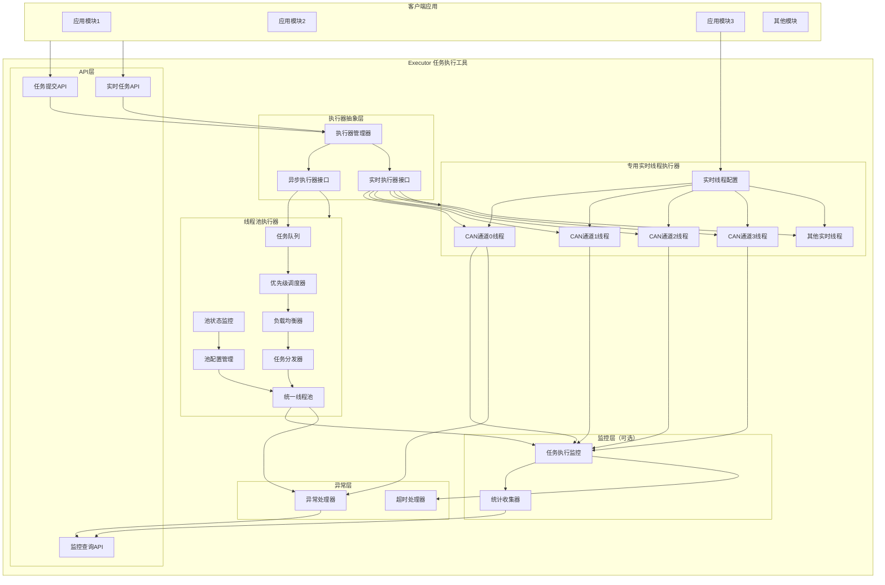

# Executor 工具项目架构设计

## 概述

`executor` 是一个轻量级的任务执行和线程管理工具库，为应用程序提供统一的线程管理和任务调度服务。该工具采用混合架构设计，支持两种执行模式：**线程池模式**用于普通并发任务，**专用实时线程模式**用于高实时性要求的任务（如实时通信、传感器采集）。通过集中式管理，提高CPU利用率，确保系统的高效并发执行。

**设计目标**：
- 统一维护线程池和专用线程，提高CPU利用率
- 支持混合执行模式：线程池（普通任务）+ 专用实时线程（实时任务）
- 直接指定执行器类型（线程池或专用实时线程）
- 支持任务优先级调度和负载均衡
- 提供基础监控和统计功能（可选）
- 聚焦核心功能，保持设计简洁

## 核心职责

1. **执行器管理**：统一管理线程池执行器和专用实时线程执行器
2. **执行器选择**：直接指定执行器类型（线程池或专用实时线程）
3. **线程池管理**：统一维护系统级线程池，动态调整线程数量（用于普通任务）
4. **专用线程管理**：管理专用实时线程，支持高优先级、CPU亲和性、精确周期控制（用于实时任务）
5. **任务调度**：支持任务提交、优先级调度、负载均衡
6. **基础监控**：监控执行器状态、任务执行时间（可选，默认启用）
7. **异常处理**：处理任务执行异常，防止任务阻塞执行器

**设计原则**：
- **单一职责**：聚焦任务执行和线程管理，不提供数据管理和锁管理功能
- **最小化依赖**：依赖标准库（`std::thread`、`std::atomic`、`std::shared_mutex`），不重新实现标准库功能
- **可配置性**：监控功能可选，允许用户根据需要选择
- **简洁高效**：保持设计简洁，避免过度设计
- **职责分离**：
  - `ExecutorManager`：底层管理器，负责执行器的创建、注册、生命周期管理
  - `Executor`：高级 API Facade，提供便捷接口，内部委托给 `ExecutorManager`
- **统一生命周期管理**：所有执行器的生命周期由 `ExecutorManager` 统一管理，使用 RAII 模式

## 系统架构图



## 详细设计说明

### 1. 执行器接口设计

**功能描述**：
- 分离异步执行器接口和实时执行器接口，语义清晰
- 线程池执行器实现异步执行器接口
- 专用实时线程执行器实现实时执行器接口
- 通过接口分离，避免语义混乱

**设计说明**：
- **接口分离**：线程池和实时线程的语义差异大，分离接口更符合实际使用场景
- **语义清晰**：异步执行器用于任务提交和等待，实时执行器用于周期执行
- **类型安全**：编译期检查，避免误用

**异步执行器接口**（用于线程池）：
```cpp
// 异步执行器状态
struct AsyncExecutorStatus {
    std::string name;
    bool is_running;
    size_t active_tasks;
    size_t completed_tasks;
    size_t failed_tasks;
    size_t queue_size;
    double avg_task_time_ms;
};

// 异步执行器接口（用于线程池）
class IAsyncExecutor {
public:
    virtual ~IAsyncExecutor() = default;
    
    // 提交任务（返回Future）
    template<typename F, typename... Args>
    auto submit(F&& f, Args&&... args)
        -> std::future<typename std::result_of<F(Args...)>::type>;
    
    // 获取执行器名称
    virtual std::string get_name() const = 0;
    
    // 获取执行器状态
    virtual AsyncExecutorStatus get_status() const = 0;
    
    // 启动执行器
    virtual bool start() = 0;
    
    // 停止执行器
    virtual void stop() = 0;
    
    // 等待所有任务完成
    virtual void wait_for_completion() = 0;
};
```

**实时执行器接口**（用于专用实时线程）：
```cpp
// 实时执行器状态
struct RealtimeExecutorStatus {
    std::string name;
    bool is_running;
    int64_t cycle_period_ns;
    int64_t cycle_count;
    int64_t cycle_timeout_count;
    double avg_cycle_time_ns;
    double max_cycle_time_ns;
};

// 实时执行器接口（用于专用实时线程）
class IRealtimeExecutor {
public:
    virtual ~IRealtimeExecutor() = default;
    
    // 启动实时线程
    virtual bool start() = 0;
    
    // 停止实时线程
    virtual void stop() = 0;
    
    // 推送任务到无锁队列（在周期回调中处理）
    virtual void push_task(std::function<void()> task) = 0;
    
    // 获取执行器名称
    virtual std::string get_name() const = 0;
    
    // 获取执行器状态
    virtual RealtimeExecutorStatus get_status() const = 0;
    
    // 注意：实时执行器不提供 submit() 接口
    // 因为实时线程是周期执行的，任务通过 push_task() 传递
};
```

### 2. 执行器选择机制

**功能描述**：
- 提供执行器管理器，统一创建和管理执行器
- 异步执行器（线程池）作为默认执行器，直接使用
- 实时执行器需要先注册，然后通过名称获取

**设计说明**：
- **接口分离**：异步执行器和实时执行器接口分离，使用方式不同
- **显式优于隐式**：调用者明确选择使用哪个执行器
- **类型安全**：编译期类型检查，避免误用

**执行器管理不对称的设计意图**：
- **异步执行器（线程池）**：
  - 作为"默认"执行器，适合大多数场景
  - 一个进程通常只需要一个线程池
  - 通过 `get_default_async_executor()` 直接获取，使用简单
  - **设计原因**：满足大多数并发任务需求，简化使用

- **实时执行器（专用线程）**：
  - 通常需要多个实例（如多个CAN通道、多个传感器）
  - 每个实例有不同的配置（周期、优先级、CPU亲和性）
  - 通过命名注册，便于管理和区分
  - **设计原因**：实时任务通常需要多个独立实例，需要命名区分

- **未来扩展**：如果未来需要多个异步执行器，可以在 `ExecutorManager` 中扩展接口：
  ```cpp
  bool register_async_executor(const std::string& name, ...);
  IAsyncExecutor* get_async_executor(const std::string& name);
  ```
  或者创建多个 `ExecutorManager` 实例（实例化模式）

**执行器管理器**：
```cpp
class ExecutorManager {
public:
    // 单例模式
    static ExecutorManager& instance();
    
    // 实例化模式（支持创建独立实例）
    ExecutorManager();
    ~ExecutorManager();  // RAII：自动释放所有执行器
    
    // 初始化默认异步执行器
    bool initialize_async_executor(const ExecutorConfig& config);
    
    // 获取默认异步执行器（线程池）
    IAsyncExecutor* get_default_async_executor();
    
    // 注册实时执行器
    bool register_realtime_executor(const std::string& name, 
                                   std::unique_ptr<IRealtimeExecutor> executor);
    
    // 获取已注册的实时执行器
    IRealtimeExecutor* get_realtime_executor(const std::string& name);
    
    // 创建实时执行器（便捷方法）
    std::unique_ptr<IRealtimeExecutor> create_realtime_executor(
        const std::string& name,
        const RealtimeThreadConfig& config);
    
    // 获取所有实时执行器名称
    std::vector<std::string> get_realtime_executor_names() const;
    
    // 关闭所有执行器
    void shutdown(bool wait_for_tasks = true);
    
private:
    // 默认异步执行器（线程池）
    std::unique_ptr<IAsyncExecutor> default_async_executor_;
    
    // 实时执行器注册表
    std::unordered_map<std::string, std::unique_ptr<IRealtimeExecutor>> realtime_executors_;
    mutable std::shared_mutex mutex_;
};
```

**使用说明**：
- **异步执行器（线程池）**：
  - 作为"默认"执行器，适合大多数场景
  - 一个进程通常只需要一个线程池
  - 通过 `get_default_async_executor()` 直接获取，使用简单
  - **设计意图**：异步执行器作为默认执行器，满足大多数并发任务需求

- **实时执行器（专用线程）**：
  - 通常需要多个实例（如多个CAN通道、多个传感器）
  - 每个实例有不同的配置（周期、优先级、CPU亲和性）
  - 需要先注册，通过 `get_realtime_executor(name)` 获取，用于周期执行任务
  - **设计意图**：实时执行器需要命名注册，便于管理和区分多个实例

- **接口分离**：避免混淆，编译期类型检查

**生命周期管理**：
- 所有执行器（异步和实时）的生命周期由 `ExecutorManager` 统一管理
- 使用 RAII 模式，`ExecutorManager` 析构时自动释放所有执行器
- 支持单例模式和实例化模式，两种模式的生命周期管理一致

### 3. 线程池执行器

**功能描述**：
- 实现 `IAsyncExecutor` 接口的线程池执行器
- 用于处理普通并发任务
- 支持动态扩缩容和负载均衡

**线程池执行器实现**：
```cpp
class ThreadPoolExecutor : public IAsyncExecutor {
public:
    ThreadPoolExecutor(const std::string& name,
                      const ThreadPoolConfig& config);
    
    template<typename F, typename... Args>
    auto submit(F&& f, Args&&... args)
        -> std::future<typename std::result_of<F(Args...)>::type> {
        return thread_pool_.submit(std::forward<F>(f), std::forward<Args>(args)...);
    }
    
    std::string get_name() const override {
        return name_;
    }
    
    AsyncExecutorStatus get_status() const override {
        auto pool_status = thread_pool_.get_status();
        AsyncExecutorStatus status;
        status.name = name_;
        status.is_running = !thread_pool_.is_stopped();
        status.active_tasks = pool_status.active_threads;
        status.completed_tasks = pool_status.completed_tasks;
        status.failed_tasks = pool_status.failed_tasks;
        status.queue_size = pool_status.queue_size;
        status.avg_task_time_ms = pool_status.avg_task_time_ms;
        return status;
    }
    
    bool start() override {
        return thread_pool_.initialize();
    }
    
    void stop() override {
        thread_pool_.shutdown();
    }
    
    void wait_for_completion() override {
        thread_pool_.wait_for_completion();
    }
    
private:
    std::string name_;
    ThreadPool thread_pool_;
};
```

### 4. 专用实时线程执行器

**功能描述**：
- 实现 `IRealtimeExecutor` 接口的专用实时线程执行器
- 用于处理高实时性任务（如实时通信、传感器采集）
- 支持高优先级、CPU亲和性、精确周期控制
- 内置简单周期实现（默认），支持可选的周期管理器接口（用于更精确的控制）

**设计说明**：
- **默认实现**：executor内置简单的周期实现（使用`std::this_thread::sleep_until`），满足大多数场景需求
- **可选增强**：通过`ICycleManager`接口，允许外部注入周期管理器，实现更精确的周期控制和监控
- **零依赖**：不强制依赖外部周期管理模块，保持工具库的独立性
- **灵活扩展**：需要精确周期控制的场景可以实现`ICycleManager`接口并注入

**周期管理器接口**（可选）：
```cpp
// 周期管理器接口（可选，用于更精确的周期控制和监控）
// 如果不提供，executor使用内置的简单周期实现
class ICycleManager {
public:
    virtual ~ICycleManager() = default;
    
    // 注册周期任务
    virtual bool register_cycle(const std::string& name,
                                int64_t period_ns,
                                std::function<void()> callback) = 0;
    
    // 启动周期任务
    virtual bool start_cycle(const std::string& name) = 0;
    
    // 停止周期任务
    virtual void stop_cycle(const std::string& name) = 0;
    
    // 获取周期统计信息（可选）
    virtual CycleStatistics get_statistics(const std::string& name) const = 0;
};
```

**实时线程配置**：
```cpp
struct RealtimeThreadConfig {
    std::string thread_name;
    int64_t cycle_period_ns;          // 周期（纳秒），如2000000表示2ms
    int thread_priority;               // 线程优先级（SCHED_FIFO: 1-99）
    std::vector<int> cpu_affinity;     // CPU亲和性（绑定到特定核心）
    std::function<void()> cycle_callback; // 周期回调函数
    // 可选：外部周期管理器接口（用于更精确的周期控制和监控）
    // 如果不提供，使用内置的简单周期实现（sleep_until）
    ICycleManager* cycle_manager = nullptr;  // 可选的周期管理器接口
};
```

**专用实时线程执行器实现**：
```cpp
class RealtimeThreadExecutor : public IRealtimeExecutor {
public:
    RealtimeThreadExecutor(const std::string& name,
                          const RealtimeThreadConfig& config);
    
    // 注意：不实现 submit() 接口，实时线程通过 push_task() 传递任务
    void push_task(std::function<void()> task) override {
        // 任务通过无锁队列传递，在周期回调中处理
        lockfree_queue_.push(task);
    }
    
    std::string get_name() const override {
        return name_;
    }
    
    RealtimeExecutorStatus get_status() const override {
        RealtimeExecutorStatus status;
        status.name = name_;
        status.is_running = running_.load();
        status.cycle_period_ns = config_.cycle_period_ns;
        status.cycle_count = cycle_count_.load();
        status.cycle_timeout_count = cycle_timeout_count_.load();
        status.avg_cycle_time_ns = avg_cycle_time_ns_.load();
        status.max_cycle_time_ns = max_cycle_time_ns_.load();
        return status;
    }
    
    bool start() override {
        if (running_) {
            return false;
        }
        
        running_ = true;
        
        // 创建专用线程
        thread_ = std::thread([this]() {
            // 设置线程优先级
            set_thread_priority(config_.thread_priority);
            
            // 设置CPU亲和性
            if (!config_.cpu_affinity.empty()) {
                set_cpu_affinity(config_.cpu_affinity);
            }
            
            // 如果提供了外部周期管理器，使用它进行精确周期控制
            if (config_.cycle_manager) {
                config_.cycle_manager->register_cycle(
                    name_,
                    config_.cycle_period_ns,
                    [this]() {
                        cycle_loop();
                    }
                );
                config_.cycle_manager->start_cycle(name_);
            } else {
                // 否则使用内置的简单周期循环（默认实现）
                simple_cycle_loop();
            }
        });
        
        return true;
    }
    
    void stop() override {
        running_ = false;
        if (thread_.joinable()) {
            thread_.join();
        }
    }
    
private:
    // 周期循环（使用外部周期管理器）
    void cycle_loop() {
        // 执行周期回调
        if (config_.cycle_callback) {
            config_.cycle_callback();
        }
        
        // 处理无锁队列中的任务
        std::function<void()> task;
        while (lockfree_queue_.pop(task)) {
            try {
                task();
            } catch (...) {
                // 异常处理
                exception_handler_.handle_task_exception(name_, 
                    std::current_exception());
            }
        }
    }
    
    // 简单周期循环（内置默认实现，不使用外部周期管理器）
    void simple_cycle_loop() {
        auto next_cycle_time = std::chrono::steady_clock::now();
        
        while (running_) {
            // 执行周期回调
            if (config_.cycle_callback) {
                config_.cycle_callback();
            }
            
            // 处理无锁队列中的任务
            std::function<void()> task;
            while (lockfree_queue_.pop(task)) {
                try {
                    task();
                } catch (...) {
                    exception_handler_.handle_task_exception(name_, 
                        std::current_exception());
                }
            }
            
            // 等待下一个周期
            next_cycle_time += std::chrono::nanoseconds(config_.cycle_period_ns);
            std::this_thread::sleep_until(next_cycle_time);
        }
    }
    
    std::string name_;
    RealtimeThreadConfig config_;
    std::thread thread_;
    std::atomic<bool> running_;
    LockFreeQueue<std::function<void()>> lockfree_queue_;
    ExceptionHandler exception_handler_;
    
    // 统计信息
    std::atomic<int64_t> cycle_count_;
    std::atomic<int64_t> cycle_timeout_count_;
    std::atomic<double> avg_cycle_time_ns_;
    std::atomic<double> max_cycle_time_ns_;
};
```

### 5. 线程池管理模块

**功能描述**：
- 统一维护系统级线程池，避免各模块独立创建线程
- 动态调整线程数量，根据负载自动扩缩容
- 支持线程优先级和CPU亲和性设置
- 提供线程池状态监控和统计

**线程池实现**：
```cpp
class ThreadPool {
public:
    // 初始化线程池
    bool initialize(size_t min_threads = 4, 
                    size_t max_threads = 16,
                    size_t queue_capacity = 1000);
    
    // 提交任务（返回Future）
    template<typename F, typename... Args>
    auto submit(F&& f, Args&&... args) 
        -> std::future<typename std::result_of<F(Args...)>::type>;
    
    // 提交优先级任务
    template<typename F, typename... Args>
    auto submit_priority(int priority, F&& f, Args&&... args)
        -> std::future<typename std::result_of<F(Args...)>::type>;
    
    // 获取线程池状态
    ThreadPoolStatus get_status() const;
    
    // 动态调整线程数量
    bool resize(size_t new_size);
    
    // 关闭线程池
    void shutdown(bool wait_for_tasks = true);
    
private:
    std::vector<std::thread> workers_;           // 工作线程
    std::queue<Task> task_queue_;                // 任务队列
    std::mutex queue_mutex_;                     // 队列锁
    std::condition_variable condition_;          // 条件变量
    std::atomic<bool> stop_;                     // 停止标志
    ThreadPoolConfig config_;                    // 配置信息
};
```

**线程池配置**：
```cpp
struct ThreadPoolConfig {
    size_t min_threads;              // 最小线程数（默认：CPU核心数）
    size_t max_threads;              // 最大线程数（默认：CPU核心数 * 2）
    size_t queue_capacity;           // 任务队列容量
    int thread_priority;             // 线程优先级（-20到19，Linux）
    std::vector<int> cpu_affinity;   // CPU亲和性（绑定到特定核心）
    int64_t task_timeout_ms;         // 任务超时时间（毫秒）
    bool enable_work_stealing;       // 启用工作窃取
};
```

**线程池状态**：
```cpp
struct ThreadPoolStatus {
    size_t total_threads;            // 总线程数
    size_t active_threads;           // 活跃线程数
    size_t idle_threads;             // 空闲线程数
    size_t queue_size;               // 队列中任务数
    size_t total_tasks;              // 总任务数
    size_t completed_tasks;          // 已完成任务数
    size_t failed_tasks;             // 失败任务数
    double avg_task_time_ms;         // 平均任务执行时间
    double cpu_usage_percent;        // CPU使用率
};
```

**动态扩缩容策略**：
1. **扩容条件**：
   - 队列中任务数 > 队列容量的80%
   - 平均任务等待时间 > 100ms
   - 当前线程数 < max_threads

2. **缩容条件**：
   - 空闲线程数 > 总线程数的50%
   - 队列中任务数 < 队列容量的20%
   - 持续空闲时间 > 60秒
   - 当前线程数 > min_threads

3. **扩缩容步骤**：
   - 扩容：创建新线程，加入工作线程池
   - 缩容：标记空闲线程，等待当前任务完成后退出

### 6. 任务调度模块

**功能描述**：
- 支持任务优先级调度
- 实现负载均衡，避免线程饥饿
- 支持任务依赖和任务链
- 提供任务超时和取消机制

**任务定义**：
```cpp
enum class TaskPriority {
    LOW = 0,
    NORMAL = 1,
    HIGH = 2,
    CRITICAL = 3
};

struct Task {
    std::string task_id;                    // 任务ID
    TaskPriority priority;                  // 任务优先级
    std::function<void()> function;         // 任务函数
    int64_t submit_time_ns;                 // 提交时间
    int64_t timeout_ms;                     // 超时时间（毫秒）
    std::vector<std::string> dependencies;  // 依赖任务ID
    std::atomic<bool> cancelled;            // 取消标志
};
```

**优先级调度器**：
```cpp
class PriorityScheduler {
public:
    // 添加任务到优先级队列
    void enqueue(const Task& task);
    
    // 从优先级队列获取任务
    Task dequeue();
    
    // 获取队列状态
    size_t size() const;
    bool empty() const;
    
private:
    // 使用多级队列实现优先级调度
    std::priority_queue<Task> critical_queue_;   // 关键任务队列
    std::priority_queue<Task> high_queue_;      // 高优先级队列
    std::priority_queue<Task> normal_queue_;    // 普通优先级队列
    std::priority_queue<Task> low_queue_;       // 低优先级队列
    mutable std::mutex queue_mutex_;
};
```

**负载均衡策略**：
1. **工作窃取（Work Stealing）**：
   - 每个线程维护本地任务队列
   - 当本地队列为空时，从其他线程队列窃取任务
   - 减少全局队列锁竞争

2. **轮询调度（Round Robin）**：
   - 任务按顺序分配给线程
   - 确保任务均匀分布

3. **最少任务优先（Least Tasks First）**：
   - 将任务分配给当前任务数最少的线程
   - 动态负载均衡

**任务依赖管理**：
```cpp
class TaskDependencyManager {
public:
    // 注册任务依赖
    bool add_dependency(const std::string& task_id, 
                       const std::string& depends_on);
    
    // 检查任务是否可执行（所有依赖已完成）
    bool is_ready(const std::string& task_id) const;
    
    // 标记任务完成
    void mark_completed(const std::string& task_id);
    
private:
    std::unordered_map<std::string, std::vector<std::string>> dependencies_;
    std::unordered_set<std::string> completed_tasks_;
    mutable std::shared_mutex mutex_;  // 读写锁
};
```

### 7. 数据管理最佳实践

**说明**：Executor 不提供数据管理和锁管理功能，用户应直接使用 C++ 标准库。

**线程本地存储**：
```cpp
// 使用 C++11 thread_local 关键字
thread_local MyData my_data;  // 每个线程有独立的数据副本

void task_function() {
    my_data.value = 100;  // 线程内写操作
    
    // 需要跨线程访问时，创建拷贝（快照）
    auto snapshot = my_data;
    Executor::instance().submit([snapshot]() {
        int value = snapshot.value;  // 只读访问
    });
}
```

**共享数据同步**：
```cpp
// 使用 std::shared_mutex 实现读写锁
#include <shared_mutex>

class SharedConfig {
    mutable std::shared_mutex mutex_;
    int value_;
public:
    int get_value() const {
        std::shared_lock<std::shared_mutex> lock(mutex_);
        return value_;
    }
    
    void set_value(int v) {
        std::unique_lock<std::shared_mutex> lock(mutex_);
        value_ = v;
    }
};

// 使用 std::atomic 实现原子操作
#include <atomic>

std::atomic<int> counter{0};

void increment() {
    counter.fetch_add(1);  // 原子操作
}
```

**无锁队列**：
```cpp
// 使用第三方库（如 boost::lockfree::queue）或自行实现
#include <boost/lockfree/queue.hpp>

boost::lockfree::queue<Data> data_queue{100};
data_queue.push(data);
Data item;
if (data_queue.pop(item)) {
    // 处理数据
}
```

### 8. 任务执行监控模块

**功能描述**：
- 监控任务执行时间
- 统计任务成功率和失败率
- 检测任务超时
- 提供任务执行报告

**任务监控实现**：
```cpp
class TaskMonitor {
public:
    // 记录任务开始
    void record_task_start(const std::string& task_id);
    
    // 记录任务完成
    void record_task_complete(const std::string& task_id, 
                             bool success,
                             int64_t execution_time_ns);
    
    // 记录任务超时
    void record_task_timeout(const std::string& task_id);
    
    // 获取任务统计信息
    TaskStatistics get_statistics(const std::string& task_type) const;
    
    // 获取所有任务统计
    std::map<std::string, TaskStatistics> get_all_statistics() const;
    
private:
    struct TaskInfo {
        std::string task_type;
        int64_t total_count;
        int64_t success_count;
        int64_t fail_count;
        int64_t timeout_count;
        int64_t total_execution_time_ns;
        int64_t max_execution_time_ns;
        int64_t min_execution_time_ns;
    };
    
    std::unordered_map<std::string, TaskInfo> task_stats_;
    mutable std::mutex stats_mutex_;
};
```

### 9. 异常处理模块

**功能描述**：
- 捕获任务执行异常，防止异常传播到执行器
- 处理任务超时，自动取消超时任务
- 记录异常日志，支持异常分析

**异常处理器**：
```cpp
class ExceptionHandler {
public:
    // 处理任务异常
    void handle_task_exception(const std::string& task_id,
                              const std::exception& e);
    
    // 处理任务超时
    void handle_task_timeout(const std::string& task_id);
    
    // 设置异常回调（可选）
    void set_exception_callback(
        std::function<void(const std::string& task_id, 
                          const std::exception& e)> callback);
    
private:
    std::function<void(const std::string&, const std::exception&)> exception_callback_;
};
```

**说明**：
- 死锁检测功能已移除，建议通过代码审查和静态分析工具发现死锁问题
- 异常处理保持简单，专注于防止异常传播到执行器

## API 设计

### 核心API

**1. 初始化API**：
```cpp
class Executor {
public:
    // 单例模式（默认）：使用全局 ExecutorManager 单例
    static Executor& instance();
    
    // 实例化模式（支持创建独立实例）：创建独立的 ExecutorManager 实例
    Executor();
    ~Executor();  // ExecutorManager 析构时会自动释放所有执行器
    
    // 初始化执行器（委托给 ExecutorManager）
    bool initialize(const ExecutorConfig& config);
    
    // 关闭执行器（委托给 ExecutorManager）
    void shutdown(bool wait_for_tasks = true);
    
    // 其他API...
    
private:
    ExecutorManager* manager_;  // 指向 ExecutorManager（单例或实例）
    std::unique_ptr<ExecutorManager> owned_manager_;  // 实例化模式时拥有
    
    Executor(ExecutorManager& manager);  // 单例模式构造函数
};
```

**设计说明**：
- **Executor 作为 Facade**：`Executor` 类作为高级 API 的 Facade 模式，内部委托给 `ExecutorManager`
- **职责分离**：
  - `ExecutorManager`：底层管理器，负责执行器的创建、注册、生命周期管理
  - `Executor`：高级 API Facade，提供便捷接口，不直接管理执行器
- **生命周期管理统一**：所有执行器的生命周期由 `ExecutorManager` 统一管理，使用 RAII 模式

**使用方式**：

```cpp
// 方式1：单例模式（同一进程内共享）
auto& executor = Executor::instance();
executor.initialize(config);
executor.submit([]() { /* 任务 */ });
// ExecutorManager 单例的生命周期与程序相同

// 方式2：实例化模式（独立实例，资源隔离）
Executor executor_a;
executor_a.initialize(config_a);
executor_a.submit([]() { /* 项目A的任务 */ });
// Executor 析构时，ExecutorManager 自动释放所有执行器

Executor executor_b;
executor_b.initialize(config_b);
executor_b.submit([]() { /* 项目B的任务 */ });

// 方式3：直接使用 ExecutorManager（底层 API，如果需要更细粒度的控制）
auto& manager = ExecutorManager::instance();
manager.initialize_async_executor(config);
manager.get_default_async_executor()->submit(...);
```

**2. 任务提交API**（异步执行器）：
```cpp
// 提交任务（使用默认线程池）
template<typename F, typename... Args>
auto Executor::submit(F&& f, Args&&... args)
    -> std::future<typename std::result_of<F(Args...)>::type>;

// 提交优先级任务
template<typename F, typename... Args>
auto Executor::submit_priority(int priority, F&& f, Args&&... args)
    -> std::future<typename std::result_of<F(Args...)>::type>;

// 提交延迟任务
template<typename F, typename... Args>
auto Executor::submit_delayed(int64_t delay_ms, F&& f, Args&&... args)
    -> std::future<typename std::result_of<F(Args...)>::type>;

// 提交周期性任务（使用线程池）
std::string Executor::submit_periodic(int64_t period_ms, 
                                        std::function<void()> task);

// 取消任务
bool Executor::cancel_task(const std::string& task_id);
```

**3. 实时任务注册API**：
```cpp
// 注册实时任务（创建专用实时线程）
bool Executor::register_realtime_task(const std::string& name,
                                      const RealtimeThreadConfig& config);

// 启动实时任务
bool Executor::start_realtime_task(const std::string& name);

// 停止实时任务
void Executor::stop_realtime_task(const std::string& name);

// 获取实时执行器
IRealtimeExecutor* Executor::get_realtime_executor(const std::string& name);

// 获取所有实时任务列表
std::vector<std::string> Executor::get_realtime_task_list() const;
```

**4. 监控查询API**（可选，默认启用基础监控）：
```cpp
// 获取异步执行器（线程池）状态
AsyncExecutorStatus Executor::get_async_executor_status() const;

// 获取实时执行器状态
RealtimeExecutorStatus Executor::get_realtime_executor_status(
    const std::string& name) const;

// 获取任务统计信息
TaskStatistics Executor::get_task_statistics(const std::string& task_type) const;

// 获取所有任务统计
std::map<std::string, TaskStatistics> Executor::get_all_task_statistics() const;

// 启用/禁用监控（运行时配置）
void Executor::enable_monitoring(bool enable);
```

## 使用示例

### 示例1：基本任务提交
```cpp
// 初始化执行器
ExecutorConfig config;
config.min_threads = 4;
config.max_threads = 16;
Executor::instance().initialize(config);

// 提交普通任务
auto future = Executor::instance().submit([]() {
    // 任务逻辑
    return 42;
});

int result = future.get();  // 等待结果

// 提交优先级任务
auto high_priority_future = Executor::instance().submit_priority(
    static_cast<int>(TaskPriority::HIGH),
    []() {
        // 高优先级任务逻辑
    }
);
```

### 示例2：使用标准库进行数据同步
```cpp
#include <shared_mutex>
#include <atomic>

// 使用 std::shared_mutex 实现读写锁
class SharedConfig {
    mutable std::shared_mutex mutex_;
    int value_;
public:
    int get_value() const {
        std::shared_lock<std::shared_mutex> lock(mutex_);
        return value_;
    }
    
    void set_value(int v) {
        std::unique_lock<std::shared_mutex> lock(mutex_);
        value_ = v;
    }
};

SharedConfig config;

// 多线程并发读
for (int i = 0; i < 10; ++i) {
    Executor::instance().submit([&config]() {
        int value = config.get_value();  // 并发读操作
    });
}

// 单线程写
Executor::instance().submit([&config]() {
    config.set_value(200);  // 独占写操作
});

// 使用 std::atomic 实现原子操作
std::atomic<int> counter{0};

// 多线程并发增加
for (int i = 0; i < 100; ++i) {
    Executor::instance().submit([&counter]() {
        counter.fetch_add(1);  // 原子操作
    });
}

// 读取值
int value = counter.load();
```

### 示例3：实时通信线程（专用线程模式）

**场景**：应用需要4个通信通道，每个通道需要500Hz（2ms周期）的实时通信。

```cpp
// 定义控制指令和反馈数据的无锁队列
struct ControlCommand {
    int joint_id;
    double target_position;
    double target_velocity;
    double target_torque;
};

struct FeedbackData {
    int joint_id;
    double position;
    double velocity;
    double torque;
};

// 为每个CAN通道创建无锁队列（使用第三方库，如 boost::lockfree::queue）
#include <boost/lockfree/queue.hpp>

boost::lockfree::queue<ControlCommand> can_command_queues[4];
boost::lockfree::queue<FeedbackData> can_feedback_queues[4];

// 注册4个CAN通道的专用实时线程
for (int i = 0; i < 4; ++i) {
    RealtimeThreadConfig config;
    config.thread_name = "can_channel_" + std::to_string(i);
    config.cycle_period_ns = 2000000;  // 2ms周期（500Hz）
    config.thread_priority = 99;       // 最高实时优先级（SCHED_FIFO）
    config.cpu_affinity = {i};         // 绑定到CPU核心i
    // 可选：注入外部周期管理器（用于更精确的周期控制）
    // config.cycle_manager = &my_cycle_manager;
    
    // 周期回调函数：CAN通信逻辑
    config.cycle_callback = [i, &can_command_queues, &can_feedback_queues]() {
        // 1. 从无锁队列读取控制指令
        ControlCommand cmd;
        if (can_command_queues[i].pop(cmd)) {
            // 2. 发送CAN指令到关节
            can_send(i, cmd.joint_id, cmd.target_position, 
                    cmd.target_velocity, cmd.target_torque);
        }
        
        // 3. 接收CAN反馈数据
        FeedbackData feedback;
        if (can_receive(i, &feedback.joint_id, &feedback.position,
                       &feedback.velocity, &feedback.torque)) {
            // 4. 将反馈数据放入无锁队列
            can_feedback_queues[i].push(feedback);
        }
    };
    
    // 注册并启动实时任务
    Executor::instance().register_realtime_task(
        "can_channel_" + std::to_string(i),
        config
    );
    Executor::instance().start_realtime_task("can_channel_" + std::to_string(i));
}

// 在控制器线程中（线程池模式）发送控制指令
Executor::instance().submit([]() {
    // PD控制器计算出的控制指令
    ControlCommand cmd;
    cmd.joint_id = 0;
    cmd.target_position = calculate_target_position();
    cmd.target_velocity = calculate_target_velocity();
    cmd.target_torque = calculate_target_torque();
    
    // 通过无锁队列发送到CAN线程（非阻塞）
    can_command_queues[0].push(cmd);
});

// 在数据处理线程中（线程池模式）读取反馈数据
Executor::instance().submit([]() {
    FeedbackData feedback;
    if (can_feedback_queues[0].pop(feedback)) {
        // 处理反馈数据
        process_feedback(feedback);
    }
});
```

**关键设计点**：
1. **专用实时线程**：每个通信通道使用专用线程，保证严格的2ms周期
2. **高优先级**：设置最高实时优先级（99），不被普通线程抢占
3. **CPU亲和性**：绑定到特定CPU核心，避免缓存失效和迁移开销
4. **无锁队列**：使用无锁队列传递控制指令和反馈数据，避免锁竞争
5. **周期控制**：支持精确周期控制，监控周期执行时间

### 示例4：传感器采集实时线程

```cpp
// 注册IMU传感器采集的专用实时线程
RealtimeThreadConfig imu_config;
imu_config.thread_name = "imu_acquisition";
imu_config.cycle_period_ns = 5000000;  // 5ms周期（200Hz）
imu_config.thread_priority = 90;
imu_config.cpu_affinity = {4};  // 绑定到CPU核心4
// 可选：注入外部周期管理器（如果不提供，使用内置的简单周期实现）
// imu_config.cycle_manager = &my_cycle_manager;

imu_config.cycle_callback = []() {
    // 读取传感器数据
    SensorData sensor_data;
    read_sensor(&sensor_data);
    
    // 将数据放入无锁队列（供其他线程读取）
    sensor_data_queue.push(sensor_data);
};

Executor::instance().register_realtime_task("sensor_acquisition", imu_config);
Executor::instance().start_realtime_task("sensor_acquisition");
```

### 示例5：向实时线程推送任务

```cpp
// 获取实时执行器
auto* realtime_executor = Executor::instance().get_realtime_executor("can_channel_0");

// 向实时线程推送任务（通过无锁队列）
realtime_executor->push_task([]() {
    // 这个任务会在实时线程的下一个周期回调中执行
    // 注意：实时线程是周期执行的，任务在周期回调中处理
});
```

### 示例6：多项目/多模块使用场景

**场景1：同一应用的不同模块，共享线程池（单例模式）**

```cpp
// 主模块：初始化全局 Executor
ExecutorConfig global_config;
global_config.min_threads = 8;
global_config.max_threads = 32;
Executor::instance().initialize(global_config);

// 模块A：使用全局 Executor
void module_a_function() {
    Executor::instance().submit([]() {
        // 模块A的任务
    });
}

// 模块B：使用全局 Executor（共享同一个线程池）
void module_b_function() {
    Executor::instance().submit([]() {
        // 模块B的任务
    });
}
```

**场景2：不同项目，资源隔离（实例化模式）**

```cpp
// 项目A：创建独立的 Executor 实例
class ProjectA {
    Executor executor_;  // 独立的 Executor 实例
    
public:
    ProjectA() {
        ExecutorConfig config;
        config.min_threads = 4;
        config.max_threads = 16;
        executor_.initialize(config);
    }
    
    void do_work() {
        executor_.submit([]() {
            // 项目A的任务，使用独立的线程池
        });
    }
};

// 项目B：创建独立的 Executor 实例
class ProjectB {
    Executor executor_;  // 独立的 Executor 实例
    
public:
    ProjectB() {
        ExecutorConfig config;
        config.min_threads = 2;
        config.max_threads = 8;
        executor_.initialize(config);
    }
    
    void do_work() {
        executor_.submit([]() {
            // 项目B的任务，使用独立的线程池
        });
    }
};

// 使用
ProjectA project_a;
ProjectB project_b;

project_a.do_work();  // 使用项目A的线程池
project_b.do_work();  // 使用项目B的线程池（完全隔离）
```

**场景3：混合模式**

```cpp
// 全局共享的 Executor（用于通用任务）
ExecutorConfig global_config;
global_config.min_threads = 8;
global_config.max_threads = 32;
Executor::instance().initialize(global_config);

// 特殊模块：创建独立的 Executor（用于特殊任务）
Executor special_executor;
ExecutorConfig special_config;
special_config.min_threads = 2;
special_config.max_threads = 4;
special_config.thread_priority = 10;  // 高优先级
special_executor.initialize(special_config);

// 通用任务：使用全局 Executor
Executor::instance().submit([]() {
    // 通用任务
});

// 特殊任务：使用独立的 Executor
special_executor.submit([]() {
    // 特殊任务，使用独立的线程池
});
```

## 模块间通信

### 数据流方向

1. **任务提交流**：
   ```
   各模块 → 任务提交API → 任务队列 → 优先级调度器 → 线程池
   ```

2. **数据访问流**：
   ```
   线程内 → thread_local（C++标准库）
   跨线程 → std::shared_ptr<const T>（只读视图）
   共享数据 → std::shared_mutex / std::atomic（C++标准库）
   ```

3. **监控数据流**：
   ```
   线程池 → 任务监控 → 性能分析 → 统计收集 → 监控查询API
   ```

### 通信协议

- **API调用**：通过共享库/头文件提供C++ API，各模块直接链接调用
- **线程间通信**：使用无锁队列（如 boost::lockfree::queue）
- **数据同步**：使用 C++ 标准库（std::shared_mutex、std::atomic）

## 性能要求

1. **吞吐量要求**：
   - 任务提交延迟：< 1ms
   - 任务调度延迟：< 0.5ms

2. **资源要求**：
   - CPU占用率：< 10%（管理开销）
   - 内存占用：< 100MB（线程池和统计）
   - 线程池线程数量：4-16个（可配置）
   - 专用实时线程数量：根据实时任务需求（如4个CAN通道 = 4个专用线程）

3. **监控性能要求**（可选）：
   - 监控开销：< 5%（相对于任务执行时间）
   - 统计收集延迟：< 0.1ms

4. **实时性要求**（专用实时线程）：
   - 周期抖动：< 周期时间的5%
   - 周期超时检测：< 1ms
   - 无锁队列操作延迟：< 0.01ms
   - 线程切换延迟：< 0.1ms（通过CPU亲和性减少）

## 设计原则

1. **单一职责**：聚焦任务执行和线程管理，不提供数据管理和锁管理功能
2. **最小化依赖**：依赖 C++ 标准库，不重新实现标准库已有的功能
3. **接口分离**：异步执行器和实时执行器接口分离，语义清晰
4. **混合执行模式**：实时任务使用专用线程，普通任务使用线程池
5. **统一管理**：所有执行器（线程池和专用线程）统一管理，提高CPU利用率
6. **可配置性**：监控功能可选，允许用户根据需要选择
7. **异常安全**：任务异常不影响执行器，支持异常恢复
8. **简洁高效**：保持设计简洁，避免过度设计

## 集成说明

### 作为独立工具库使用

`executor` 设计为独立的工具库，可以：
- 作为静态库或动态库链接到其他项目
- 通过头文件提供C++ API接口
- 支持单例模式或实例化模式使用
- 不依赖特定的业务模块，可灵活集成

### 多项目/多模块使用场景

**重要说明**：Executor 的线程池管理行为取决于使用模式：

#### 1. 单例模式（默认）

如果使用 `Executor::instance()` 单例模式：

```cpp
// 项目A和项目B都使用单例模式
// 项目A
Executor::instance().initialize(config_a);

// 项目B（同一进程）
Executor::instance().initialize(config_b);  // 会覆盖项目A的配置
```

**行为**：
- **同一进程内**：所有模块共享**同一个** Executor 实例和线程池
  - 优点：节省资源，统一管理，提高CPU利用率
  - 缺点：模块间可能相互影响（任务竞争、配置冲突）
- **不同进程**：每个进程有**独立的** Executor 实例和线程池
  - 进程间完全隔离，互不影响

**适用场景**：
- 同一应用的不同模块，需要共享线程池资源
- 希望统一管理和监控所有任务

#### 2. 实例化模式（推荐用于多模块场景）

如果需要资源隔离，可以创建独立的 Executor 实例：

```cpp
// 项目A：创建独立的 Executor 实例
Executor executor_a;
executor_a.initialize(config_a);
executor_a.submit([]() { /* 项目A的任务 */ });
// Executor 析构时，ExecutorManager 自动释放所有执行器

// 项目B：创建独立的 Executor 实例
Executor executor_b;
executor_b.initialize(config_b);
executor_b.submit([]() { /* 项目B的任务 */ });
```

**行为**：
- 每个 Executor 实例内部创建**独立的** `ExecutorManager` 实例
- 每个 `ExecutorManager` 维护**独立的**线程池和执行器
- 完全资源隔离，互不影响
- 可以独立配置和管理
- **生命周期管理**：使用 RAII 模式，`ExecutorManager` 析构时自动释放所有执行器

**适用场景**：
- 不同项目/模块需要资源隔离
- 不同模块有不同的性能要求
- 需要独立的监控和统计

#### 3. 混合模式

也可以混合使用：

```cpp
// 全局共享的 Executor（单例）
auto& global_executor = Executor::instance();
global_executor.initialize(global_config);

// 项目A：使用全局 Executor
global_executor.submit([]() { /* 项目A的任务 */ });

// 项目B：创建独立的 Executor 实例
Executor project_b_executor;
project_b_executor.initialize(project_b_config);
project_b_executor.submit([]() { /* 项目B的任务 */ });
```

#### 设计建议

**推荐做法**：
1. **同一应用的不同模块**：使用单例模式，共享线程池
2. **不同的独立项目**：使用实例化模式，资源隔离
3. **需要特殊配置的模块**：创建独立的 Executor 实例

**注意事项**：
- 如果使用单例模式，确保所有模块使用相同的配置，或者由主模块统一初始化
- 如果使用实例化模式，`Executor` 析构时会自动释放所有执行器（RAII 模式），无需手动管理
- 实时线程执行器总是与创建它的 `ExecutorManager` 实例绑定，不会跨实例共享

**生命周期管理说明**：
- **统一管理**：所有执行器（异步和实时）的生命周期由 `ExecutorManager` 统一管理
- **RAII 模式**：`ExecutorManager` 析构时自动关闭所有执行器，确保资源正确释放
- **单例模式**：`ExecutorManager` 单例的生命周期与程序相同
- **实例化模式**：每个 `Executor` 实例拥有独立的 `ExecutorManager`，析构时自动释放

### 可选的外部集成

`executor` 支持与外部模块集成（可选）：

- **实时周期管理模块**（可选接口）：
  - executor提供`ICycleManager`接口，允许外部注入周期管理器
  - 如果不提供周期管理器，executor使用内置的简单周期实现（`sleep_until`）
  - 对于需要精确周期控制和监控的场景，可以实现`ICycleManager`接口并注入
  - 支持注册周期回调，监控周期执行时间，检测超时和延迟

- **监控和状态上报**：
  - 可以上报线程池和专用实时线程的状态、任务统计到外部监控系统
  - 支持异常信息上报接口

- **应用场景示例**：
  - **实时通信场景**：多个通信通道使用专用实时线程，保证严格的周期执行
  - **传感器采集场景**：传感器数据采集使用专用实时线程，数据通过无锁队列传递
  - **数据处理场景**：普通数据处理任务使用线程池，支持并发处理
  - **控制计算场景**：控制算法计算使用线程池，结果通过无锁队列传递给实时线程

- **数据流示例**：
  ```
  控制器（线程池）→ 无锁队列 → 实时通信线程（专用实时线程）→ 外部接口
  外部接口 → 实时通信线程（专用实时线程）→ 无锁队列 → 数据处理（线程池）
  数据处理（线程池）→ 只读视图 → 算法计算（线程池）
  ```

## 最佳实践

1. **数据设计**：
   - 使用 `thread_local` 实现线程本地存储
   - 使用 `std::shared_mutex` 实现读写锁
   - 使用 `std::atomic` 实现原子操作
   - 使用无锁队列（如 boost::lockfree::queue）进行高频数据传递

2. **任务设计**：
   - 任务函数应该是纯函数或最小化副作用
   - 避免在任务中持有锁过长时间
   - 使用任务优先级区分关键任务和普通任务

3. **性能优化**：
   - 监控锁竞争情况，优化锁粒度
   - 使用无锁数据结构处理高频数据传递（如CAN通信）
   - 合理设置线程池大小，避免过度创建线程
   - 实时任务使用专用线程，避免任务调度开销
   - 合理设置CPU亲和性，减少缓存失效和线程迁移

4. **异常处理**：
   - 在任务中捕获异常，避免异常传播到执行器
   - 使用超时机制防止任务无限阻塞
   - 记录异常日志，便于问题诊断
   - 专用实时线程的异常需要特别处理，避免影响周期执行

5. **实时任务设计**：
   - 实时任务应该尽可能简单，避免长时间阻塞
   - 使用无锁队列进行数据传递，避免锁竞争
   - 进行周期监控，及时发现性能问题
   - 合理设置线程优先级和CPU亲和性，保证实时性
