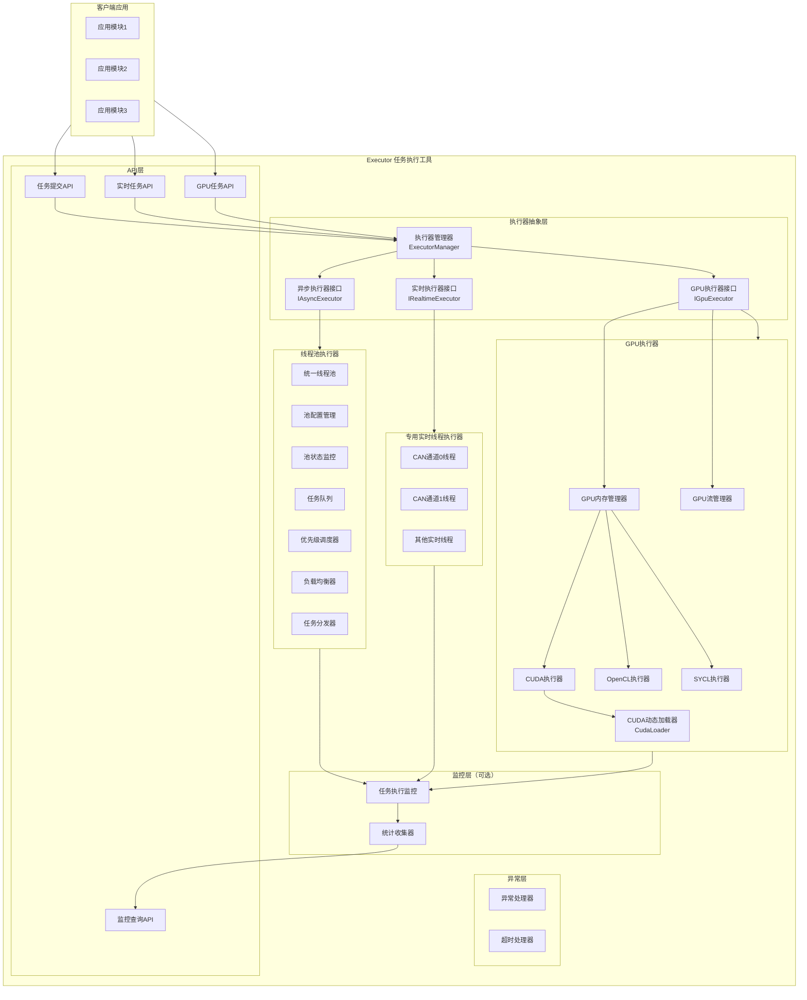

# GPU 执行器扩展方案设计

## 概述

本文档描述了 executor 项目中 GPU 执行器的扩展方案。该方案在现有架构基础上，新增 GPU 执行器接口，支持 GPU 任务调度和管理，与现有的 CPU 线程池执行器和实时线程执行器形成统一的异构计算平台。

**设计目标**：
- 扩展执行器类型，支持 GPU 计算资源
- 与现有架构无缝集成，保持接口一致性
- 支持多种 GPU 后端（CUDA、OpenCL、SYCL）
- 提供统一的内存管理和任务调度接口
- 支持多 GPU 设备管理
- 保持最小化依赖原则（GPU 支持为可选模块）

**设计原则**：
- **接口分离**：GPU 执行器使用独立的接口，与 CPU 执行器接口分离，语义清晰
- **统一管理**：通过 ExecutorManager 统一管理 CPU 和 GPU 执行器
- **可选依赖**：GPU 支持为可选模块，不强制依赖 GPU 库
- **多后端支持**：支持 CUDA、OpenCL、SYCL 等多种 GPU 后端
- **资源隔离**：每个 GPU 执行器管理独立的 GPU 设备资源

---

## 系统架构扩展

### 扩展后的架构图



---

## 详细设计说明

### 1. GPU 执行器接口设计

**功能描述**：
- 定义 GPU 执行器接口，与 CPU 执行器接口分离
- 支持 GPU kernel 任务提交
- 提供 GPU 内存管理接口
- 支持 GPU 流（Stream）管理
- 提供 GPU 设备状态查询

**设计说明**：
- **接口分离**：GPU 执行器与 CPU 执行器语义不同，使用独立接口更清晰
- **多后端支持**：通过策略模式支持多种 GPU 后端
- **内存管理**：提供统一的内存管理接口，隐藏后端差异
- **异步执行**：GPU 任务天然异步，使用 future 模式返回结果

**GPU 执行器接口**：

```cpp
namespace executor {
namespace gpu {

/**
 * @brief GPU 后端类型
 */
enum class GpuBackend {
    CUDA,      // NVIDIA CUDA
    OPENCL,    // OpenCL (跨平台)
    SYCL,      // SYCL (Intel/AMD)
    HIP        // AMD ROCm
};

/**
 * @brief GPU 设备信息
 */
struct GpuDeviceInfo {
    std::string name;                    // 设备名称
    GpuBackend backend;                  // 后端类型
    int device_id = 0;                   // 设备ID
    size_t total_memory_bytes = 0;       // 总内存（字节）
    size_t free_memory_bytes = 0;        // 空闲内存（字节）
    int compute_capability_major = 0;     // 计算能力主版本（CUDA）
    int compute_capability_minor = 0;     // 计算能力次版本（CUDA）
    size_t max_threads_per_block = 0;     // 每个Block最大线程数
    size_t max_blocks_per_grid[3] = {0, 0, 0};  // Grid最大维度
};

/**
 * @brief GPU 执行器状态
 */
struct GpuExecutorStatus {
    std::string name;                    // 执行器名称
    bool is_running = false;             // 是否运行中
    GpuBackend backend;                  // 后端类型
    int device_id = 0;                   // 设备ID
    size_t active_kernels = 0;           // 活跃kernel数
    size_t completed_kernels = 0;        // 已完成kernel数
    size_t failed_kernels = 0;           // 失败kernel数
    size_t queue_size = 0;                // 任务队列大小
    double avg_kernel_time_ms = 0.0;     // 平均kernel执行时间（毫秒）
    size_t memory_used_bytes = 0;        // 已使用内存（字节）
    size_t memory_total_bytes = 0;       // 总内存（字节）
    double memory_usage_percent = 0.0;   // 内存使用率
};

/**
 * @brief GPU 任务配置
 */
struct GpuTaskConfig {
    size_t grid_size[3] = {1, 1, 1};     // Grid维度
    size_t block_size[3] = {1, 1, 1};      // Block维度
    size_t shared_memory_bytes = 0;       // 共享内存大小（字节）
    int stream_id = 0;                    // 流ID（0表示默认流）
    bool async = true;                    // 是否异步执行
};

} // namespace gpu

/**
 * @brief GPU 执行器接口
 * 
 * 提供 GPU kernel 任务提交、内存管理、流管理等功能
 */
class IGpuExecutor {
public:
    virtual ~IGpuExecutor() = default;

    /**
     * @brief 提交 GPU kernel 任务
     * 
     * @tparam KernelFunc GPU kernel 函数类型
     * @param kernel GPU kernel 函数（类型擦除，通过回调执行）
     * @param config GPU 任务配置
     * @return std::future<void> 任务执行结果的 future
     */
    template<typename KernelFunc>
    auto submit_kernel(KernelFunc&& kernel, const gpu::GpuTaskConfig& config)
        -> std::future<void>;

    /**
     * @brief 分配设备内存
     * 
     * @param size 内存大小（字节）
     * @return 设备内存指针，失败返回 nullptr
     */
    virtual void* allocate_device_memory(size_t size) = 0;

    /**
     * @brief 释放设备内存
     * 
     * @param ptr 设备内存指针
     */
    virtual void free_device_memory(void* ptr) = 0;

    /**
     * @brief 从主机内存复制到设备内存
     * 
     * @param dst 目标设备内存指针
     * @param src 源主机内存指针
     * @param size 复制大小（字节）
     * @param async 是否异步复制
     * @return 是否成功
     */
    virtual bool copy_to_device(void* dst, const void* src, size_t size, bool async = false) = 0;

    /**
     * @brief 从设备内存复制到主机内存
     * 
     * @param dst 目标主机内存指针
     * @param src 源设备内存指针
     * @param size 复制大小（字节）
     * @param async 是否异步复制
     * @return 是否成功
     */
    virtual bool copy_to_host(void* dst, const void* src, size_t size, bool async = false) = 0;

    /**
     * @brief 在设备内存之间复制
     * 
     * @param dst 目标设备内存指针
     * @param src 源设备内存指针
     * @param size 复制大小（字节）
     * @param async 是否异步复制
     * @return 是否成功
     */
    virtual bool copy_device_to_device(void* dst, const void* src, size_t size, bool async = false) = 0;

    /**
     * @brief 同步所有操作
     * 
     * 等待所有已提交的 GPU 操作完成
     */
    virtual void synchronize() = 0;

    /**
     * @brief 同步指定流
     * 
     * @param stream_id 流ID
     */
    virtual void synchronize_stream(int stream_id) = 0;

    /**
     * @brief 创建新的流
     * 
     * @return 流ID，失败返回 -1
     */
    virtual int create_stream() = 0;

    /**
     * @brief 销毁流
     * 
     * @param stream_id 流ID
     */
    virtual void destroy_stream(int stream_id) = 0;

    /**
     * @brief 获取执行器名称
     * @return 执行器名称
     */
    virtual std::string get_name() const = 0;

    /**
     * @brief 获取 GPU 设备信息
     * @return GPU 设备信息
     */
    virtual gpu::GpuDeviceInfo get_device_info() const = 0;

    /**
     * @brief 获取执行器状态
     * @return GPU 执行器状态
     */
    virtual gpu::GpuExecutorStatus get_status() const = 0;

    /**
     * @brief 启动执行器
     * @return 是否启动成功
     */
    virtual bool start() = 0;

    /**
     * @brief 停止执行器
     */
    virtual void stop() = 0;

    /**
     * @brief 等待所有任务完成
     */
    virtual void wait_for_completion() = 0;

protected:
    /**
     * @brief 提交 GPU kernel 实现（内部方法）
     * 
     * @param kernel_func GPU kernel 函数（类型擦除）
     * @param config GPU 任务配置
     * @return std::future<void> 任务执行结果的 future
     */
    virtual std::future<void> submit_kernel_impl(
        std::function<void()> kernel_func,
        const gpu::GpuTaskConfig& config) = 0;
};

// 模板方法实现
template<typename KernelFunc>
auto IGpuExecutor::submit_kernel(KernelFunc&& kernel, const gpu::GpuTaskConfig& config)
    -> std::future<void> {
    // 类型擦除：将 kernel 函数包装为 std::function
    auto kernel_func = [kernel = std::forward<KernelFunc>(kernel)]() mutable {
        kernel();  // 调用实际的 kernel 函数
    };
    return submit_kernel_impl(std::move(kernel_func), config);
}

} // namespace executor
```

---

### 2. GPU 执行器配置

**GPU 执行器配置结构**：

```cpp
namespace executor {
namespace gpu {

/**
 * @brief GPU 执行器配置
 */
struct GpuExecutorConfig {
    std::string name;                    // 执行器名称
    GpuBackend backend = GpuBackend::CUDA;  // GPU后端类型
    int device_id = 0;                   // GPU设备ID
    size_t max_queue_size = 1000;        // 最大任务队列大小
    size_t memory_pool_size = 0;         // 内存池大小（0表示不使用内存池）
    int default_stream_count = 1;        // 默认流数量
    bool enable_unified_memory = false;  // 是否启用统一内存（Unified Memory）
    bool enable_monitoring = true;       // 启用监控（默认开启）
};

} // namespace gpu
} // namespace executor
```

**配置说明**：
- `backend`：指定 GPU 后端类型（CUDA、OpenCL、SYCL 等）
- `device_id`：指定使用的 GPU 设备ID（支持多 GPU）
- `max_queue_size`：任务队列最大容量
- `memory_pool_size`：内存池大小，0 表示不使用内存池（直接分配）
- `default_stream_count`：默认创建的流数量
- `enable_unified_memory`：是否启用统一内存（需要硬件支持）
- `enable_monitoring`：是否启用任务监控

---

### 3. ExecutorManager 扩展

**扩展 ExecutorManager 以支持 GPU 执行器**：

```cpp
class ExecutorManager {
public:
    // ... 现有方法 ...

    /**
     * @brief 注册 GPU 执行器
     * 
     * @param name 执行器名称
     * @param executor 执行器指针（所有权转移）
     * @return 是否注册成功（如果名称已存在则返回 false）
     */
    bool register_gpu_executor(const std::string& name,
                              std::unique_ptr<IGpuExecutor> executor);

    /**
     * @brief 获取已注册的 GPU 执行器
     * 
     * @param name 执行器名称
     * @return GPU 执行器指针，如果不存在则返回 nullptr
     */
    IGpuExecutor* get_gpu_executor(const std::string& name);

    /**
     * @brief 创建 GPU 执行器（便捷方法）
     * 
     * 注意：此方法仅创建执行器对象，不会自动注册
     * 需要调用 register_gpu_executor() 进行注册
     * 
     * @param config GPU 执行器配置
     * @return 执行器指针，如果创建失败则返回 nullptr
     */
    std::unique_ptr<IGpuExecutor> create_gpu_executor(
        const gpu::GpuExecutorConfig& config);

    /**
     * @brief 获取所有 GPU 执行器名称
     * 
     * @return GPU 执行器名称列表
     */
    std::vector<std::string> get_gpu_executor_names() const;

private:
    // GPU 执行器注册表
    std::unordered_map<std::string, std::unique_ptr<IGpuExecutor>> gpu_executors_;
    mutable std::shared_mutex gpu_mutex_;  // 保护 GPU 执行器注册表
};
```

---

### 4. Executor Facade 扩展

**扩展 Executor 类以支持 GPU 任务提交**：

```cpp
class Executor {
public:
    // ... 现有方法 ...

    /**
     * @brief 注册 GPU 执行器
     * 
     * 创建并注册 GPU 执行器。
     * 
     * @param name 执行器名称
     * @param config GPU 执行器配置
     * @return 是否注册成功
     */
    bool register_gpu_executor(const std::string& name,
                              const gpu::GpuExecutorConfig& config);

    /**
     * @brief 提交 GPU kernel 任务
     * 
     * @tparam KernelFunc GPU kernel 函数类型
     * @param executor_name GPU 执行器名称
     * @param kernel GPU kernel 函数
     * @param config GPU 任务配置
     * @return std::future<void> 任务执行结果的 future
     */
    template<typename KernelFunc>
    auto submit_gpu(const std::string& executor_name,
                   KernelFunc&& kernel,
                   const gpu::GpuTaskConfig& config)
        -> std::future<void>;

    /**
     * @brief 获取 GPU 执行器
     * 
     * @param name 执行器名称
     * @return GPU 执行器指针，如果不存在则返回 nullptr
     */
    IGpuExecutor* get_gpu_executor(const std::string& name);

    /**
     * @brief 获取所有 GPU 执行器名称
     * 
     * @return GPU 执行器名称列表
     */
    std::vector<std::string> get_gpu_executor_names() const;

    /**
     * @brief 获取 GPU 执行器状态
     * 
     * @param name 执行器名称
     * @return GPU 执行器状态
     */
    gpu::GpuExecutorStatus get_gpu_executor_status(const std::string& name) const;
};
```

---

### 5. GPU 执行器实现

#### 5.1 CUDA 执行器实现

**CUDA 动态加载器设计**：

为了支持 CUDA 不在系统 PATH 中的场景，以及实现真正的可选依赖，CUDA 执行器使用动态加载机制：

```cpp
namespace executor {
namespace gpu {

/**
 * @brief CUDA 函数指针类型定义
 */
using CudaFreeFunc = cudaError_t (*)(void*);
using CudaGetDeviceCountFunc = cudaError_t (*)(int*);
using CudaSetDeviceFunc = cudaError_t (*)(int);
using CudaGetDevicePropertiesFunc = cudaError_t (*)(cudaDeviceProp*, int);
using CudaMallocFunc = cudaError_t (*)(void**, size_t);
using CudaMemcpyFunc = cudaError_t (*)(void*, const void*, size_t, cudaMemcpyKind);
// ... 其他函数指针类型 ...

/**
 * @brief CUDA 函数指针集合
 */
struct CudaFunctionPointers {
    CudaFreeFunc cudaFree = nullptr;
    CudaGetDeviceCountFunc cudaGetDeviceCount = nullptr;
    // ... 其他函数指针 ...
    
    bool is_complete() const;  // 检查所有函数是否已加载
};

/**
 * @brief CUDA 动态加载器（单例模式）
 * 
 * 负责动态搜索和加载 CUDA DLL，获取 CUDA 函数指针。
 * 支持自动搜索常见安装路径，即使 CUDA 不在 PATH 中也能工作。
 */
class CudaLoader {
public:
    static CudaLoader& instance();
    
    bool load();  // 加载 CUDA DLL
    void unload();  // 卸载 CUDA DLL
    bool is_available() const;  // 检查是否可用
    const CudaFunctionPointers& get_functions() const;  // 获取函数指针集合
    std::string get_dll_path() const;  // 获取已加载的 DLL 路径

private:
    std::string search_cuda_dll();  // 搜索 CUDA DLL
    bool try_load_dll(const std::string& dll_path);  // 尝试加载 DLL
    bool load_functions();  // 加载所有函数指针
    
#ifdef _WIN32
    std::string search_windows_paths();  // Windows 路径搜索
#else
    std::string search_linux_paths();  // Linux 路径搜索
#endif
    
    mutable std::mutex mutex_;
    bool is_loaded_;
    std::string dll_path_;
#ifdef _WIN32
    HMODULE dll_handle_;
#else
    void* dll_handle_;
#endif
    CudaFunctionPointers functions_;
};

} // namespace gpu
} // namespace executor
```

**DLL 搜索策略**：

1. **环境变量**：优先检查 `CUDA_PATH` 环境变量
2. **常见安装路径**：
   - Windows: `C:\Program Files\NVIDIA GPU Computing Toolkit\CUDA\v*\bin\`
   - Linux: `/usr/local/cuda*/lib64/`
3. **系统 PATH**：最后从系统 PATH/LD_LIBRARY_PATH 搜索

**CUDA 执行器实现**：

```cpp
namespace executor {
namespace gpu {

/**
 * @brief CUDA 执行器实现
 * 
 * 使用 CudaLoader 动态加载 CUDA 函数，所有 CUDA API 调用
 * 都通过函数指针进行，不依赖静态链接。
 */
class CudaExecutor : public IGpuExecutor {
public:
    CudaExecutor(const std::string& name, const GpuExecutorConfig& config);
    ~CudaExecutor();

    // 实现 IGpuExecutor 接口
    void* allocate_device_memory(size_t size) override;
    void free_device_memory(void* ptr) override;
    bool copy_to_device(void* dst, const void* src, size_t size, bool async = false) override;
    bool copy_to_host(void* dst, const void* src, size_t size, bool async = false) override;
    bool copy_device_to_device(void* dst, const void* src, size_t size, bool async = false) override;
    void synchronize() override;
    void synchronize_stream(int stream_id) override;
    int create_stream() override;
    void destroy_stream(int stream_id) override;
    std::string get_name() const override;
    GpuDeviceInfo get_device_info() const override;
    GpuExecutorStatus get_status() const override;
    bool start() override;
    void stop() override;
    void wait_for_completion() override;

protected:
    std::future<void> submit_kernel_impl(
        std::function<void()> kernel_func,
        const GpuTaskConfig& config) override;

private:
    std::string name_;
    GpuExecutorConfig config_;
    int device_id_;
    bool is_available_;
    CudaLoader* loader_;  // CUDA 加载器（单例引用）
    
#ifdef EXECUTOR_ENABLE_CUDA
    cudaDeviceProp device_prop_;
    cudaStream_t default_stream_;
    std::vector<cudaStream_t> streams_;
    mutable std::mutex streams_mutex_;
#endif
    
    // 内存管理
    std::unordered_map<void*, size_t> allocated_memory_;
    mutable std::mutex memory_mutex_;
    
    // 统计信息
    std::atomic<size_t> active_kernels_{0};
    std::atomic<size_t> completed_kernels_{0};
    std::atomic<size_t> failed_kernels_{0};
    std::atomic<int64_t> total_kernel_time_ns_{0};
    
    // 辅助方法
    bool check_cuda_available();
    bool initialize_device();
    bool check_cuda_error(cudaError_t error_code, const char* operation);
};

} // namespace gpu
} // namespace executor
```

**动态加载的优势**：

1. **真正的可选依赖**：程序可以在没有 CUDA 的环境中运行，不会因为缺少 DLL 而崩溃
2. **灵活的部署**：不需要将 CUDA DLL 添加到系统 PATH，程序会自动搜索
3. **多版本支持**：可以支持多个 CUDA 版本，自动选择可用的版本
4. **优雅降级**：CUDA 不可用时，执行器会安全地报告不可用，而不是崩溃

#### 5.2 OpenCL 执行器实现

```cpp
namespace executor {
namespace gpu {

/**
 * @brief OpenCL 执行器实现
 */
class OpenCLExecutor : public IGpuExecutor {
public:
    OpenCLExecutor(const std::string& name, const GpuExecutorConfig& config);
    ~OpenCLExecutor();

    // 实现 IGpuExecutor 接口
    // ... 类似 CUDA 实现 ...

private:
    cl_context context_;
    cl_device_id device_;
    cl_command_queue command_queue_;
    // ... 其他 OpenCL 资源 ...
};

} // namespace gpu
} // namespace executor
```

---

### 6. 内存管理

**GPU 内存管理器**：

```cpp
namespace executor {
namespace gpu {

/**
 * @brief GPU 内存管理器
 * 
 * 提供统一的内存管理接口，支持内存池和直接分配两种模式
 */
class GpuMemoryManager {
public:
    GpuMemoryManager(IGpuExecutor* executor, size_t pool_size = 0);
    ~GpuMemoryManager();

    /**
     * @brief 分配设备内存
     * 
     * @param size 内存大小（字节）
     * @return 设备内存指针，失败返回 nullptr
     */
    void* allocate(size_t size);

    /**
     * @brief 释放设备内存
     * 
     * @param ptr 设备内存指针
     */
    void free(void* ptr);

    /**
     * @brief 获取内存使用统计
     */
    struct MemoryStats {
        size_t total_allocated = 0;
        size_t total_free = 0;
        size_t allocation_count = 0;
    };
    MemoryStats get_stats() const;

private:
    IGpuExecutor* executor_;
    size_t pool_size_;
    // 内存池实现...
};

} // namespace gpu
} // namespace executor
```

---

## 使用示例

### 示例 1：基本 GPU 任务提交

```cpp
#include <executor/executor.hpp>
#include <executor/gpu_executor.hpp>

int main() {
    // 初始化 Executor
    auto& executor = executor::Executor::instance();
    
    // 注册 CUDA GPU 执行器
    executor::gpu::GpuExecutorConfig gpu_config;
    gpu_config.name = "cuda0";
    gpu_config.backend = executor::gpu::GpuBackend::CUDA;
    gpu_config.device_id = 0;
    
    executor.register_gpu_executor("cuda0", gpu_config);
    
    // 提交 GPU kernel 任务
    executor::gpu::GpuTaskConfig task_config;
    task_config.grid_size[0] = 1024;
    task_config.block_size[0] = 256;
    
    auto future = executor.submit_gpu("cuda0",
        [](cudaStream_t stream) {
            // CUDA kernel 调用
            my_kernel<<<1024, 256, 0, stream>>>(...);
        },
        task_config
    );
    
    // 等待任务完成
    future.wait();
    
    return 0;
}
```

### 示例 2：GPU 内存管理

```cpp
// 获取 GPU 执行器
auto* gpu_executor = executor.get_gpu_executor("cuda0");

// 分配设备内存
size_t data_size = 1024 * 1024 * sizeof(float);
float* device_data = static_cast<float*>(
    gpu_executor->allocate_device_memory(data_size)
);

// 从主机内存复制到设备内存
float* host_data = new float[1024 * 1024];
// ... 初始化 host_data ...
gpu_executor->copy_to_device(device_data, host_data, data_size, true);

// 提交 GPU kernel
executor::gpu::GpuTaskConfig config;
config.grid_size[0] = 1024;
auto future = executor.submit_gpu("cuda0",
    [device_data](cudaStream_t stream) {
        process_kernel<<<1024, 256, 0, stream>>>(device_data);
    },
    config
);

// 等待完成并复制结果回主机
future.wait();
gpu_executor->copy_to_host(host_data, device_data, data_size);

// 释放内存
gpu_executor->free_device_memory(device_data);
delete[] host_data;
```

### 示例 3：多 GPU 并行执行

```cpp
// 注册多个 GPU 执行器
for (int i = 0; i < 4; ++i) {
    executor::gpu::GpuExecutorConfig config;
    config.name = "cuda" + std::to_string(i);
    config.backend = executor::gpu::GpuBackend::CUDA;
    config.device_id = i;
    executor.register_gpu_executor("cuda" + std::to_string(i), config);
}

// 并行提交任务到多个 GPU
std::vector<std::future<void>> futures;
for (int i = 0; i < 4; ++i) {
    auto future = executor.submit_gpu("cuda" + std::to_string(i),
        [i](cudaStream_t stream) {
            process_chunk_kernel<<<blocks, threads, 0, stream>>>(i);
        },
        config
    );
    futures.push_back(std::move(future));
}

// 等待所有任务完成
for (auto& future : futures) {
    future.wait();
}
```

### 示例 4：CPU-GPU 混合执行

```cpp
// CPU 任务：处理控制逻辑
executor.submit([]() {
    // 复杂的控制逻辑
    control_logic();
});

// GPU 任务：处理大规模数据
executor.submit_gpu("cuda0",
    [](cudaStream_t stream) {
        // 大规模并行计算
        compute_kernel<<<grid, block, 0, stream>>>(data);
    },
    config
);

// 实时任务：CAN 通信
executor.register_realtime_task("can0", realtime_config);
executor.start_realtime_task("can0");
```

---

## 技术挑战与解决方案

### 挑战 1：GPU 编程模型多样性

**问题**：不同 GPU 后端（CUDA、OpenCL、SYCL）API 差异大

**解决方案**：
- 使用策略模式，为每种后端实现独立的执行器类
- 通过 `IGpuExecutor` 接口统一抽象
- 使用类型擦除技术，在接口层隐藏后端差异

### 挑战 2：内存管理复杂性

**问题**：CPU-GPU 内存传输开销大，内存管理复杂

**解决方案**：
- 提供统一的内存管理接口
- 支持内存池，减少分配开销
- 支持异步内存传输，与计算重叠
- 可选支持统一内存（Unified Memory）

### 挑战 3：任务抽象

**问题**：GPU kernel 与 CPU 函数调用方式不同

**解决方案**：
- 使用回调函数模式，用户提供 kernel 调用代码
- 通过类型擦除，在接口层统一抽象
- 提供便捷的包装器，简化使用

### 挑战 4：依赖管理

**问题**：GPU 库（CUDA、OpenCL）为可选依赖，且 CUDA DLL 可能不在系统 PATH 中

**解决方案**：
- 使用 CMake 选项控制编译
- **动态加载机制**：运行时动态搜索和加载 CUDA DLL
- 运行时检测 GPU 可用性
- 提供编译时和运行时的优雅降级

**CUDA 动态加载实现**：

```cmake
# CMakeLists.txt
option(EXECUTOR_ENABLE_GPU "Enable GPU support" OFF)
option(EXECUTOR_ENABLE_CUDA "Enable CUDA support" OFF)
option(EXECUTOR_ENABLE_OPENCL "Enable OpenCL support" OFF)

if(EXECUTOR_ENABLE_GPU)
    if(EXECUTOR_ENABLE_CUDA)
        # 查找 CUDA（用于头文件类型定义）
        find_package(CUDAToolkit QUIET)
        if(NOT CUDAToolkit_FOUND)
            find_package(CUDA QUIET)
        endif()
        
        if(CUDA_FOUND OR CUDAToolkit_FOUND)
            # 仅包含头文件，不链接库（使用动态加载）
            if(CUDA_INCLUDE_DIRS)
                target_include_directories(executor PRIVATE ${CUDA_INCLUDE_DIRS})
            elseif(CUDAToolkit_INCLUDE_DIRS)
                target_include_directories(executor PRIVATE ${CUDAToolkit_INCLUDE_DIRS})
            endif()
            # 不链接 CUDA 库，CudaLoader 会在运行时动态加载
        endif()
    endif()
    
    if(EXECUTOR_ENABLE_OPENCL)
        find_package(OpenCL REQUIRED)
        target_link_libraries(executor PRIVATE OpenCL::OpenCL)
    endif()
endif()
```

**动态加载的优势**：

1. **真正的可选依赖**：程序可以在没有 CUDA 的环境中运行，不会因为缺少 DLL 而崩溃
2. **灵活的部署**：不需要将 CUDA DLL 添加到系统 PATH，程序会自动搜索常见安装路径
3. **多版本支持**：可以支持多个 CUDA 版本（9.0-12.x），自动选择可用的版本
4. **优雅降级**：CUDA 不可用时，执行器会安全地报告不可用，而不是崩溃
5. **跨平台支持**：Windows 和 Linux 都支持动态加载机制

---

## 实现优先级

### 阶段 1：基础框架（MVP）

1. 定义 `IGpuExecutor` 接口
2. 实现 CUDA 执行器（最常用）
3. 扩展 `ExecutorManager` 支持 GPU 执行器注册
4. 扩展 `Executor` Facade 支持 GPU 任务提交
5. 基础内存管理（直接分配）

**预期时间**：2-3 周

### 阶段 2：功能完善

1. 支持多 GPU 设备
2. 异步内存传输
3. 流管理（多流并行）
4. 内存池优化
5. 监控和统计

**预期时间**：2-3 周

### 阶段 3：高级特性

1. OpenCL 执行器实现（跨平台支持）
2. SYCL 执行器实现（Intel/AMD 支持）
3. 统一内存支持
4. 智能调度（CPU/GPU 自动选择）
5. 性能优化

**预期时间**：4-6 周

---

## 性能考虑

### 1. 任务提交延迟

- **目标**：GPU 任务提交延迟 < 10μs
- **优化**：使用任务队列，批量提交
- **注意**：GPU kernel 启动本身有延迟（~10-100μs）

### 2. 内存传输优化

- **异步传输**：与计算重叠，隐藏传输延迟
- **内存池**：减少分配开销
- **统一内存**：避免显式传输（需要硬件支持）

### 3. 多流并行

- **流管理**：支持多个流并行执行
- **负载均衡**：在多 GPU 间均衡负载

### 4. 监控开销

- **目标**：监控开销 < 5%（相对于任务执行时间）
- **实现**：使用原子变量，最小化锁竞争

---

## 与现有架构的集成

### 1. 统一管理

- GPU 执行器通过 `ExecutorManager` 统一管理
- 与 CPU 执行器使用相同的生命周期管理（RAII）

### 2. 统一监控

- GPU 执行器状态通过统一的监控接口查询
- 与 CPU 执行器使用相同的统计收集器

### 3. 统一 API

- `Executor` Facade 提供统一的 API
- 用户可以通过统一的接口使用 CPU 和 GPU 执行器

### 4. 可选依赖

- GPU 支持为可选模块
- 不启用 GPU 支持时，不影响现有功能

---

## 总结

GPU 执行器扩展方案在保持现有架构一致性的基础上，新增了 GPU 计算支持。通过接口分离、统一管理、可选依赖等设计，实现了与现有 CPU 执行器的无缝集成。

**核心优势**：
1. **架构一致性**：与现有设计保持一致
2. **接口清晰**：GPU 执行器使用独立接口，语义明确
3. **多后端支持**：支持 CUDA、OpenCL、SYCL 等多种后端
4. **统一管理**：通过 ExecutorManager 统一管理所有执行器
5. **可选依赖**：GPU 支持为可选模块，不影响现有功能

**适用场景**：
- 深度学习训练/推理
- 图像/视频处理
- 科学计算（矩阵运算、FFT 等）
- 大规模数据并行处理

**下一步**：
1. 实现阶段 1 的基础框架
2. 编写单元测试和集成测试
3. 性能测试和优化
4. 文档完善
