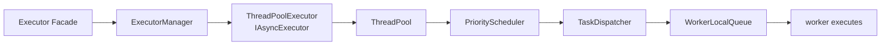
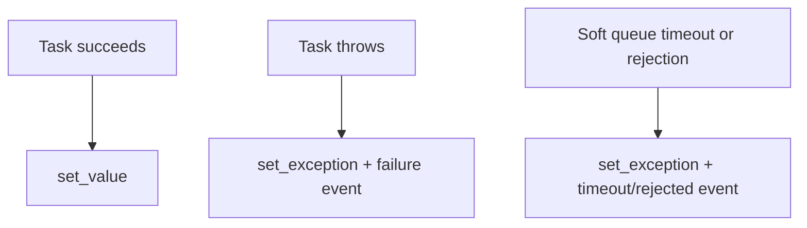
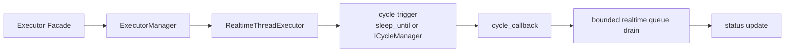

# How Tasks Travel Through Executor

## Goal

Build a debugging/performance mental model while keeping current internal paths distinct from stable public API.

## Ordinary task path



### From `submit()` to worker

1. `Executor::submit()` wraps user work to fulfill a `promise`, writes exceptions to its future, and rethrows them to the underlying executor so future and service-level failure observation agree.
2. Default manager access can lazily initialize with `std::call_once`; explicit initialization or post-shutdown use becomes diagnosable rejection.
3. `ThreadPoolExecutor` snapshots `shared_ptr<ThreadPool>` under its mutex before submission, preventing a stop/submit race from dereferencing freed pool memory.
4. `ThreadPool` places work in `PriorityScheduler` from `CRITICAL` through `LOW`. Current queues have separate mutexes; priority selects waiting work and does not preempt running work.
5. `TaskDispatcher` batch-dequeues, load-balances to a worker local queue, and requeues on invalid worker ID or a full local queue instead of silently losing a dequeued task.
6. A worker pops local work first, then steals from busier workers; completion/failure/time statistics update and waiters wake.

Facade owns future/failure/task-graph/lifecycle entry, manager owns default executor/registries, and adapter maps public async API to the pool. Work stealing improves utilization but makes a fixed worker assignment unsuitable for thread-local business assumptions.

### Every future must be fulfilled

Facade creates its own `std::promise<return_type>` rather than exposing a pool future, giving every backend identical user future/failure semantics.



An atomic `promise_ready` gives exactly-once fulfillment. Rejection/timeout callbacks compete with compare-exchange; success publishes ready after execution. Thus rejected or queued-timeout futures become ready with an exception rather than blocking forever. `future.get()` and failure callback can observe one failure but serve different roles: result vs service diagnosis.

### Task graph is scheduling relation

`submit_with_handle()` makes a `Pending` graph node, which becomes `Running`, then `Succeeded` or `Failed`. `submit_after_with_handle()` validates origin handles, adds DAG edges with cycle detection, waits for graph state, then submits actual work only when prerequisites succeed. A prerequisite exception propagates its `exception_ptr` and the dependent function does not run. `when_all()` is a virtual join node; completed nodes without dependents are pruned.

Graph state uses `task_graph_mutex_`; dependency adjacency has its own `shared_mutex`. The outer lock makes node state/dependent resolution a coherent snapshot; the inner one encapsulates edges/completion. A cross-instance handle is invalid rather than globally searched.

### Scheduler, timeout, and completion invariants

Submit creates an internal task with ID/priority/time/soft timeout, validates lifecycle under pool lock, enqueues to priority scheduler, then dispatches after releasing lifecycle lock to avoid lock-order reversal. Scheduler priority is waiting-task selection only and can starve low work under persistent high traffic. Dispatcher requeues every failed handoff branch, including partial batch push and resized local vector snapshots.

A soft timeout compares queue time immediately before execution. Timeout fulfills the future and records status without running user code. It is not an in-execution deadline: user work must have its own stop conditions and I/O timeouts.

Current pool is not wholly lock-free: priority/local queues use mutexes and vector resize uses `shared_mutex`; optional lock-free worker queues are not public API guarantees. Completion means:

```text
global scheduler empty
∧ all local queues empty
∧ active_threads == 0
∧ total_tasks == completed_tasks
```

`failed_tasks` is included in completed. `wait_for_completion_ex()` concerns only the default async executor—not all process activity—and actively dispatches pending work while rechecking because workers may have observed stop.

## Realtime task path



Each cycle runs `cycle_callback`, then pops up to `max_tasks_per_cycle` MPSC items and returns wrappers to the pool. Callback exceptions are handled without killing the thread but still need application observation. Budget `0` means unlimited; normal bounds preserve the period. Timeout increments `cycle_timeout_count`; missed timing rephases from now plus one period instead of catch-up spinning.

`push_task_ex()` registers an in-flight producer, checks running state, acquires preallocated wrapper, and enqueues. Empty work, not-running, pool exhaustion, and queue full have separate visible counts. Stop blocks producers, waits registered pushers out, then drains so no accepted wrapper appears after the final drain.

The MPSC queue is lock-free, not the entire real-time path: `ObjectPool` uses a mutex for memory-reclamation correctness, and user callback/handler/custom cycle source can lock, allocate, or call the system. “Avoid locks, unlimited waits, and runtime allocation” is a design goal and caller constraint, not a promise about every internal instruction. Measure target-hardware traces and status.

## Shutdown and stability boundary

Normal `wait_for_completion_ex()` cannot prove realtime callback/queue completion. A realtime pipeline needs its own acknowledgement, phase gate, or stop sequence. Status is a snapshot; use it plus failure/communication events rather than scheduling coincidence.

`ThreadPoolExecutor` copies a local pool `shared_ptr` under mutex; stop clears its member then shuts down the local copy. Concurrent submission therefore gets a still-live pool or a rejection, never freed memory. `stop(false)` may move pool shutdown to a detached resource-reclamation thread; it does not kill running user work or define recovery semantics.

`ThreadPool`, `PriorityScheduler`, `TaskDispatcher`, worker queues, and steal policy can change while public behavior remains stable. Treat this as current implementation explanation, not a callable integration API. See current source entries [`executor.cpp`](https://github.com/Linductor-alkaid/executor/blob/master/src/executor/executor.cpp), [`executor_manager.cpp`](https://github.com/Linductor-alkaid/executor/blob/master/src/executor/executor_manager.cpp), [`thread_pool.cpp`](https://github.com/Linductor-alkaid/executor/blob/master/src/executor/thread_pool/thread_pool.cpp), and [`task_dispatcher.hpp`](https://github.com/Linductor-alkaid/executor/blob/master/src/executor/thread_pool/task_dispatcher.hpp).

Next: [lock-free and performance experiments](/en/advanced/lockfree-and-performance) or [performance measurement](/en/advanced/performance-measurement).
