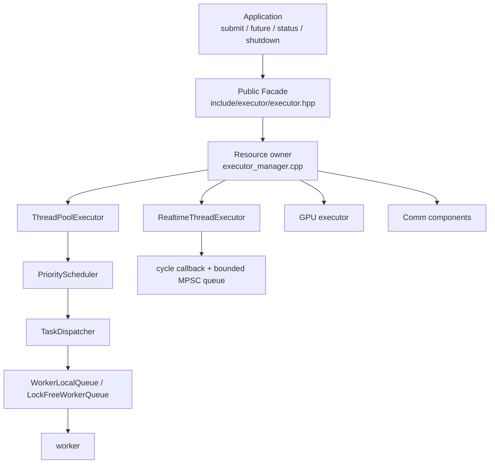
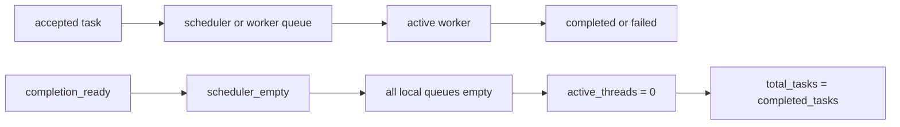
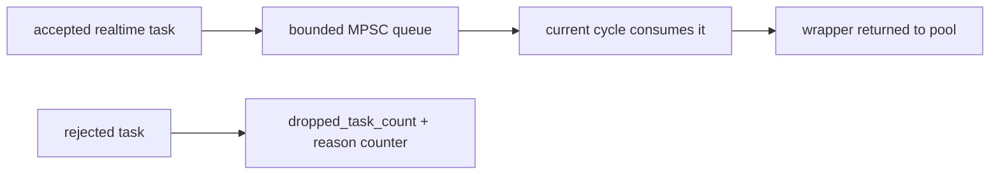

# Source Architecture Map

## What this page solves

When behavior may come from the Facade, pool, task graph, or platform layer, do not browse every header. Executor is organized around public contract, resource owner, execution path, and diagnostic path. Find the boundary, then trace one task lifecycle.

This is the current source organization. Facade/types in `include/executor/` are integration entry points; schedulers, queues, and synchronization in `src/executor/` may be refactored while tests and status APIs preserve externally observable behavior.

## Layered architecture

| Layer | Primary responsibility | Must not own |
| --- | --- | --- |
| Facade | Convert calls into observable futures, handles, and failure events | Worker queues or assumptions about a lock implementation |
| Manager | Own executors, singleton/independent instance, registration lifecycle | Business retry or data idempotency decisions |
| Adapter | Map `IAsyncExecutor`/`IRealtimeExecutor` to implementation | Change Facade business semantics |
| Scheduler/queue | Queue, dispatch, consume, backpressure | Cross-task business state |
| Monitor/diagnostics | Statistics and reporting | Blocking in callbacks or changing task result |

## Read source from the API behavior

| Behavior | Read first | Then read | Verification |
| --- | --- | --- | --- |
| `submit()` returns a future | Template in `include/executor/executor.hpp` | `src/executor/thread_pool_executor.cpp`, `thread_pool.cpp` | `tests/test_executor_facade.cpp`, exception/timeout tests |
| Dependent task does not run | Facade `TaskGraphState`, `submit_after_with_handle` | `src/executor/task/task_dependency_manager.cpp` | Facade/dependency tests and tutorial smoke |
| Priority does not preempt | `PriorityScheduler::dequeue()` | `TaskDispatcher::dispatch()`, worker loop | Priority tests and queue status |
| Resize does not lose tasks | `ThreadPool::resize_local_queues()` | `TaskDispatcher::dispatch_batch()` requeue branch | Resize/concurrent-stop tests |
| Real-time task drops | `Executor::push_realtime_task()` | `RealtimeThreadExecutor::push_task_ex()` | Push-overflow tests and status counters |
| Lock-free queue appears empty/full | `src/executor/util/lockfree_queue.hpp` | Caller capacity/object-pool logic | MPSC benchmark, TSAN/stress |

First find object ownership and exit authority: `Executor` owns a manager in its instance model, manager owns executors, adapters use `shared_ptr` snapshots for stop/submit races, while the caller owns a realtime `cycle_manager` and Executor only borrows it.

## Synchronization domains are not one global lock

| Domain | Protected object | Typical primitive | Reason |
| --- | --- | --- | --- |
| Facade failure | Counts, ring buffer, callback snapshot | `failure_mutex_` | Invoke callback after unlock to avoid diagnostic reentry |
| Facade task graph | Node state, dependent map | `task_graph_mutex_` + graph `shared_mutex` | State transition/dependency resolution need atomic observation |
| Manager registry | Realtime/GPU registry | `shared_mutex` | Many lookups, rare registration; pointer needs lifetime proof |
| Pool lifecycle | Stop, totals/completed/active | `mutex_` + atomics | Separate submit/stop boundary from completion waiting |
| Local queues | Replacement worker-queue vector | `local_queues_mutex_` + atomic `shared_ptr` | Snapshot extends old vector life through resize |
| LockFreeQueue slots | Ready/reuse sequence | acquire/release `sequences_` | Publish data and reuse slots without serializing producers |

Atomic does not mean lock-free, and removing one lock does not authorize cross-domain access. Before source changes, draw writers/readers, destruction point, and the condition variable responsible for wakeup.

## Two completion invariants

`failed_tasks` is a subset of completed work, not another term to subtract. If a task dequeued from the scheduler encounters an invalid worker ID or full local queue, dispatcher must requeue it; otherwise a successfully submitted future can never complete.

Stop blocks new producers, waits registered producers out, then drains. No accepted wrapper may appear after final drain.

## Validate source changes in order

1. Write a minimal test that exposes invariant failure: future readiness, count reconciliation, bounded shutdown.
2. Run targeted tests: graph changes use dependency/Facade tests; queue changes use MPSC/realtime overflow; resize changes use resize/concurrent-stop.
3. Validate user-visible status APIs and failure events, not only internal variables.
4. Run TSAN or stress tests; a single local concurrent pass is not race proof.
5. For performance changes, preserve environment, raw JSON, and correctness reconciliation using [performance measurement](/en/advanced/performance-measurement).

Continue with [execution paths](/en/advanced/execution-paths), [lock-free experiments](/en/advanced/lockfree-and-performance), or [custom cycle sources](/en/advanced/custom-cycle-manager).
