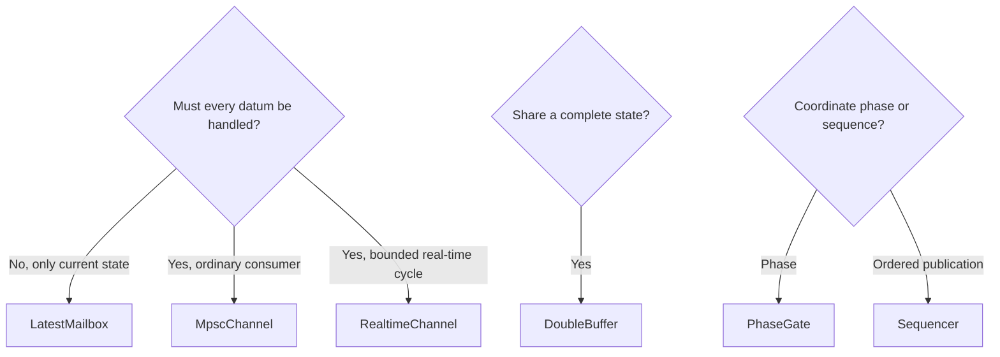

# Choose a Communication Component

Ask how data may be lost or overwritten before asking which queue is faster. These components all coordinate threads, but each represents a different business contract.

| Data semantics | Default component | Observe |
| --- | --- | --- |
| Only the latest configuration or target matters | `LatestMailbox<T>` | Sequence, new-value reads, overwrites, stale reads |
| Every message must be consumed FIFO | `MpscChannel<T>` | Capacity, drop policy, close, timeout |
| A real-time cycle consumes only a bounded number of messages | `RealtimeChannel<T>` | Nonblocking drain, per-cycle budget, drops, handler exceptions |
| Several readers need complete consistent state | `DoubleBuffer<T>` | Sequence, old/new values, single-writer/multi-reader boundary |
| Setup, calibration, and run phases advance in order | `PhaseGate` | Timeout, close, phase regression, missed phase |
| Publication must have strict ticket order | `Sequencer` | Wait timeout, close, missing sequence |

## Capacity and backpressure

Capacity is a pressure-relief contract, not an implementation detail. For `MpscChannel` and `RealtimeChannel`, decide what a full queue means: block, reject, drop newest, or drop oldest. `LatestMailbox` overwrites old values by design. Producers must observe the return value, statistics, or an event callback rather than assuming delivery.

## Close, timeout, and stale are distinct

`close` means no more data will be accepted or produced; it does not mean historical messages are processed. A timeout means an operation did not succeed within its given budget. A stale value still exists but is no longer fresh. Handle all three independently, particularly so an old configuration is never mistaken for a newly received one.

## Observation boundary

`CommStats` and `CommEventCallback` report drops, overwrites, stale reads, latency, lag, and missed phases. They do not automatically contribute to `ExecutorFailureStatus` or invoke `Executor::set_failure_callback()`. Bridge component events to your monitoring system if alerts must be unified.

See the [complete robot pipeline](/en/tutorial/complete-robot-pipeline) for a connected example. Detailed capacity and alerting guidance currently remains in Chinese; ordinary background-work selection is covered by [choose a submission API](/en/guides/choosing-submit-api).
