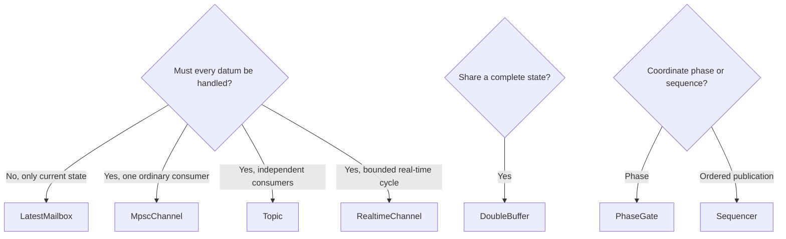

# Choose a Communication Component

Ask how data may be lost or overwritten before asking which queue is faster. These components all coordinate threads, but each represents a different business contract.

| Data semantics | Default component | Observe |
| --- | --- | --- |
| Only the latest configuration or target matters | `LatestMailbox<T>` | Sequence, new-value reads, overwrites, stale reads |
| One consumer handles every message FIFO | `MpscChannel<T>` | Capacity, drop policy, close, timeout |
| Independent consumers each receive the same subsequent event stream | `Topic<T>` | Per-subscription capacity, drop policy, close, drops, lag |
| A cycle consumes only a bounded number of messages | `RealtimeChannel<T>` | No condition-variable wait, per-cycle budget, drops, handler exceptions; mutex-backed |
| Several readers need complete consistent state | `DoubleBuffer<T>` | Sequence, old/new values, single-writer/multi-reader boundary |
| Setup, calibration, and run phases advance in order | `PhaseGate` | Timeout, close, phase regression, missed phase |
| A complete value from phase N must become visible at N+1 | Bind `DoubleBuffer<T>` or `LatestMailbox<T>` to `PhaseGate` | `CommResult`, one publish per phase, missing prior value |
| Publication must have strict ticket order | `Sequencer` | Wait timeout, close, missing sequence |

```mermaid
flowchart TD
    A{Must every datum be handled?}
    A -- No, only current state --> B[LatestMailbox]
    A -- Yes, one ordinary consumer --> C[MpscChannel]
    A -- Yes, independent consumers --> T[Topic]
    A -- Yes, bounded real-time cycle --> D[RealtimeChannel]
    E{Share a complete state?}
    E -- Yes --> F[DoubleBuffer]
    G{Coordinate phase or sequence?}
    G -- Phase --> H[PhaseGate]
    G -- Ordered publication --> I[Sequencer]
```

## Capacity and backpressure

Capacity is a pressure-relief contract, not an implementation detail. For `MpscChannel` and `RealtimeChannel`, decide what a full queue means: block, reject, drop newest, or drop oldest. `Topic` applies that choice independently to every subscription: one slow subscriber does not block the others, but the publisher must inspect `TopicPublishResult` and each subscription's statistics. `LatestMailbox` overwrites old values by design. Never assume delivery.

## Close, timeout, and stale are distinct

`close` means no more data will be accepted or produced; it does not mean historical messages are processed. A timeout means an operation did not succeed within its given budget. A stale value still exists but is no longer fresh. Handle all three independently, particularly so an old configuration is never mistaken for a newly received one.

## Observation boundary

`CommStats` and `CommEventCallback` report drops, overwrites, stale reads, latency, lag, and missed phases. They do not automatically contribute to `ExecutorFailureStatus` or invoke `Executor::set_failure_callback()`. Bridge component events to your monitoring system if alerts must be unified.

Unbound `RealtimeChannel` and `DoubleBuffer` use mutex-backed paths. Their APIs express bounded cycle consumption and complete value snapshots, respectively; neither is a lock-free or hard-real-time guarantee. For a phase-bound single value, explicitly call `bind_to_phase_gate()` on `DoubleBuffer` or `LatestMailbox`; this LET mode is fixed two-slot SWSR, not a FIFO `RealtimeChannel` replacement.

`Topic` also uses mutexes and a dynamic subscription registry, with copying and fan-out time growing with subscriber count. It is an in-process, no-replay, best-effort event primitive, not a hard-real-time path or a network broker with persistence, acknowledgement, and reconnect. Use `Topic<std::shared_ptr<const T>>` explicitly for large immutable payloads.

See the [complete robot pipeline](/en/tutorial/complete-robot-pipeline) for a connected example. For capacity and alerting, read [Capacity and Alerts](/en/realtime-and-communication/capacity-and-alerting); ordinary background-work selection is covered by [Choose a Submission API](/en/guides/choosing-submit-api).
