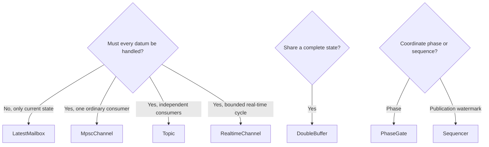

# Choose a Communication Component

Ask how data may be lost or overwritten before asking which queue is faster. These components all coordinate threads, but each represents a different business contract.

| Data semantics | Default component | Observe |
| --- | --- | --- |
| Only the latest configuration or target matters | `LatestMailbox<T>` | Sequence, new-value reads, overwrites, stale reads |
| One consumer handles every message FIFO | `MpscChannel<T>` | Capacity, drop policy, close, timeout |
| Independent consumers each receive the same subsequent event stream | `Topic<T>` | Per-subscription capacity, drop policy, close, drops, lag |
| A cycle consumes only a bounded number of messages | `RealtimeChannel<T>` | Preallocated MPSC storage, one logical consumer, per-cycle budget, drops, handler exceptions |
| Several readers need complete consistent state | `DoubleBuffer<T>` | Four reader-pinned slots, four-attempt `try_load()`, lock-free `try_publish()`, sequence, SWMR boundary |
| Setup, calibration, and run phases advance in order | `PhaseGate` | Timeout, close, phase regression, missed phase |
| A complete value from phase N must become visible at N+1 | Bind `DoubleBuffer<T>` or `LatestMailbox<T>` to `PhaseGate` | `CommResult`, one publish per phase, missing prior value |
| A monotonic publication watermark may skip tickets | `Sequencer` | Watermark reached, exact-wait timeout, close, skipped ticket |

```mermaid
flowchart TD
    A{Must every datum be handled?}
    A -- No, only current state --> B[LatestMailbox]
    A -- Yes, one ordinary consumer --> C[MpscChannel]
    A -- Yes, independent consumers --> T[Topic]
    A -- Yes, bounded real-time cycle --> D[RealtimeChannel]
    E{Share a complete state?}
    E -- Yes --> F[DoubleBuffer]
    G{Coordinate phase or sequence?}
    G -- Phase --> H[PhaseGate]
    G -- Publication watermark --> I[Sequencer]
```

## Capacity and backpressure

Capacity is a pressure-relief contract, not an implementation detail. For `MpscChannel` and `RealtimeChannel`, decide whether a full queue should be retried until a timeout, reject the newest value, drop the oldest value, or keep only the latest value. `Topic` applies the drop choice independently to every subscription: one slow subscriber does not block the others, but the publisher must inspect `TopicPublishResult` and each subscription's statistics. `LatestMailbox` overwrites old values by design. Never assume delivery.

## Close, timeout, and stale are distinct

`close` means no more data will be accepted or produced; it does not mean historical messages are processed. A timeout means an operation did not succeed within its given budget. A stale value still exists but is no longer fresh. Handle all three independently, particularly so an old configuration is never mistaken for a newly received one.

## Observation boundary

`CommStats` and `CommEventCallback` report drops, overwrites, stale reads, latency, lag, and missed phases. They do not automatically contribute to `ExecutorFailureStatus` or invoke `Executor::set_failure_callback()`. Bridge component events to your monitoring system if alerts must be unified.

`MpscChannel` and `RealtimeChannel` preallocate their bounded MPSC nodes at construction and allow one logical consumer. `LatestMailbox` and unbound `DoubleBuffer` use four fixed reader-pinned slots, so a writer never mutates a slot while a reader copies a non-trivial `T`. `PhaseGate` and `Sequencer` use nonblocking atomic state cores. These primitives reject construction when the required synchronization atomics are not lock-free.

Keep the guarantees separate. Data-race-free describes valid concurrent access; `is_synchronization_lock_free()` describes only internal synchronization atomics; preallocated internal storage says nothing about allocation inside `T`; and none of these alone proves hard real-time. Snapshot `try_load()` checks at most four slots. Snapshot `try_publish()` is non-waiting and system-wide lock-free, but its CAS may retry under contention, so it is neither per-call bounded nor wait-free. Payload operations, clocks, strings/results, callbacks, page faults, and OS scheduling remain outside the guarantee. Guaranteed/timeout compatibility APIs such as `publish()`, `load()`, `send_for()`, `receive_for()`, and phase waits may spin/yield, so real-time code must select the appropriate non-waiting API and validate a measured cycle budget. Callback configuration and invocation are control-plane diagnostics.

Snapshot sequences are finite (`2^56 - 1` is the last value): exhaustion makes `try_publish()` return `false`, while retrying publish/update compatibility APIs throw `std::overflow_error`. Phase and ticket state must be below `2^63`; invalid waits return `InvalidArgument` before polling. Phase-bound LET publication has the tighter limit `phase < 2^63 - 1` because its two-slot state reserves the maximum value as an empty sentinel.

`Sequencer` is a watermark, not a strict ticket queue. `publish(ticket)` may skip intermediate tickets; `is_published(ticket)` means the watermark reached or passed it. Exact `wait_until_published()` succeeds only at equality and returns `MissedPhase` after the watermark passes the requested ticket.

For a phase-bound single value, explicitly call `bind_to_phase_gate()` on `DoubleBuffer` or `LatestMailbox`; this LET mode is fixed two-slot SWSR, not a FIFO `RealtimeChannel` replacement.

`Topic` still uses a mutex and dynamic allocation for its subscription registry and the snapshot created by every publish fan-out; copying and fan-out time also grow with subscriber count. The whole Topic path, including `publish()`, is an in-process, no-replay, best-effort event primitive, not a hard-real-time path or a network broker with persistence, acknowledgement, and reconnect. Use `Topic<std::shared_ptr<const T>>` explicitly for large immutable payloads.

## When a raw callback is acceptable

The communication components deliberately do not ship a signal/slot or observer primitive. A raw `std::function` callback (or `CommEventCallback`) is acceptable when all of the following hold: the wiring happens once during setup, invocation frequency is low (control-plane diagnostics, not a data path), the callback body cannot block or re-enter the component, and exceptions thrown by the callback can be isolated by the caller. When those conditions do not hold, express the dependency with a component instead: fan-out belongs to `Topic<T>`, latest-value notification to `LatestMailbox<T>`, and "do X after Y completes" to a task-graph handle (`submit_after`) rather than a completion callback. A cross-thread observer primitive with statistics is a possible future addition; until then, raw callbacks stay a setup-time control-plane tool, not a runtime event bus.

See the [complete robot pipeline](/en/tutorial/complete-robot-pipeline) for a connected example. For capacity and alerting, read [Capacity and Alerts](/en/realtime-and-communication/capacity-and-alerting); ordinary background-work selection is covered by [Choose a Submission API](/en/guides/choosing-submit-api).
