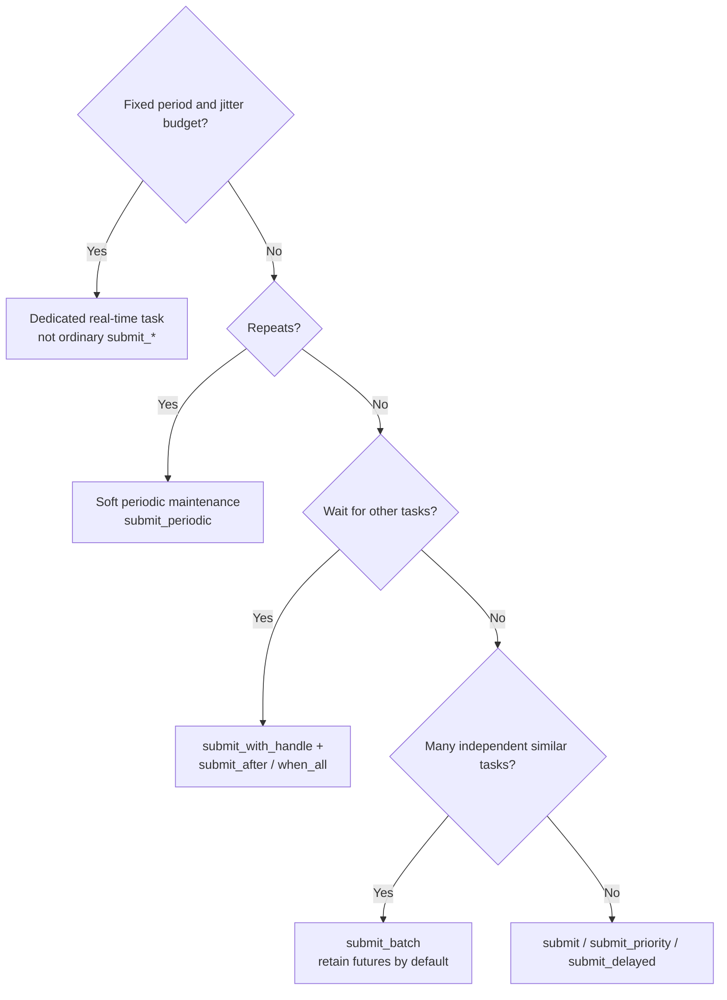

# Choose a Submission API

Describe the business constraint before comparing function names: when may work start, does it depend on other work, does the caller need each result, and what happens when a time budget is missed? For callable and argument ownership, first read [submit functions and data](/en/quick-start/task-inputs-and-ownership).

## 30-second selection table

| Problem | Default API | Control to retain | Failure observation |
| --- | --- | --- | --- |
| Run one background operation now | `submit()` | `future` | `future.get()` |
| Queue a small amount of control work first | `submit_priority()` | `future`, priority | `future.get()` |
| Retry after a relative delay | `submit_delayed()` | `future`, delay | `future.get()` |
| Ordinary background health check | `submit_periodic()` | Task ID | Periodic status, callback |
| Independent batch with per-item results | `submit_batch()` | All futures | `get()` on every future |
| Independent batch without per-item results | `submit_batch_no_future()` | Business batch ID | Failure status/callback, wait state |
| Urgent independent batch | `submit_batch_priority()` | Futures, priority | `get()` for every item |
| Work must follow successful prerequisites | `submit_after()` / `when_all()` | `TaskHandle` and future | Dependency failure reaches dependent future |

Complex policies should express correctness first. For “after two successful prerequisites, then urgent work,” build the dependency, then decide whether priority is actually needed; queue order is not a dependency mechanism.



## Default: `submit()`

Use `submit()` when work can enter the shared pool immediately and has no dependency, periodic, or batch meaning.

```cpp
auto future = executor.submit([frame] { return decode(frame); });
auto decoded = future.get();
```

Value capture gives the task stable input. A reference, raw pointer, or `this` must be proven to outlive the task. Do not submit permanent blocking loops or service listeners to the shared pool: they occupy workers needed by short work. Use an owned `std::jthread`, or a real-time path when the work has true periodic semantics.

## Priority, delay, and periodic work

`submit_priority()` only changes selection among waiting work. It cannot preempt running low-priority work, guarantee a deadline or completion order, or prevent starvation caused by blocking work. Use a project-wide LOW/NORMAL/HIGH/CRITICAL mapping; if every caller uses critical, priority has no meaning.

`submit_delayed(delay_ms, ...)` means “submit to the ordinary executor no earlier than this relative delay.” It suits retry backoff, deferred cleanup, and debouncing, not precise timing. A busy pool can delay it further. Its future remains the result/exception boundary.

`submit_periodic()` suits health checks, cache refresh, and metrics. Retain its task ID; define cancellation, observation of execution/failure counts, a response to consecutive failures, and behavior when a callback approaches or exceeds its period. It is not a strict-period control API.

## Batch and dependency work

Batch APIs require independent tasks produced together with equivalent scheduling semantics. They can reduce repeated submission-path overhead, but gains depend on task count/body, worker count, hardware, and build; no fixed speedup is promised. Default to `submit_batch()` and consume every future. Consider `submit_batch_no_future()` only if per-item results are unnecessary, service-level failure observation exists, shutdown has a bounded or explicitly lossy policy, and failures can be associated with a business batch/input.

Use `submit_with_handle()`, `submit_after()`, and `when_all()` for “model load → parallel preprocessing → plan.” A failed prerequisite prevents ordinary dependent execution and appears in its future. Do not hide task relations behind `future.get()` inside arbitrary worker lambdas. Current dependent wrappers may wait in the pool, so submit prerequisites first, cap in-flight graphs, and test at the minimum worker count. Use a dedicated graph scheduler for large dynamic DAGs. Handles are valid only in their originating Executor instance.

## Time budgets are not cancellation

`wait_for_completion_ex(timeout)` reports incomplete work and a snapshot; it does not safely kill a running C++ function. Make I/O bounded, let long work check a stop signal or deadline, and split interruptible work into steps. Likewise, `shutdown(true)` is an orderly-exit policy, not a guarantee that an arbitrary permanent task ends promptly.

Before production, assign an owner to every future/task ID, keep periodic cancellation and failure policies, avoid using priority for correctness, make batch work independent, ensure all tasks are bounded or cooperatively stoppable, and observe queue growth, rejection, and wait timeout. For continuous data between threads, use a [communication component](/en/guides/choosing-communication), not task submission semantics.
