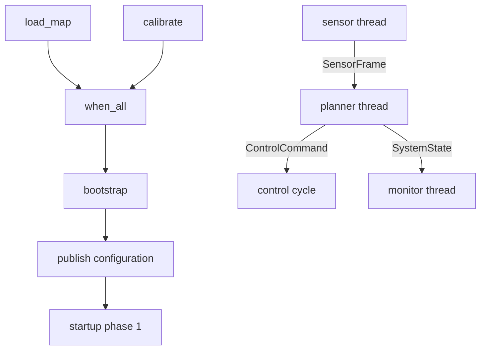

# Complete Robot Pipeline

The preceding tutorials explained submission, dependencies, and passing values across threads. A real system combines those choices and defines ownership, capacity, failure, and shutdown semantics for every edge. This page uses `comm_robot_pipeline` as its fact source.

## What we are building



Completion dependencies use Executor tasks and `TaskHandle`; continuous frame, configuration, command, and status flow uses `executor::comm`. Neither model substitutes for the other.

## Define data ownership first

| Data | Producer | Consumer | Ownership model |
| --- | --- | --- | --- |
| `SensorFrame` | Sensor thread | Planner thread | Value enters a bounded queue and is removed by consumption |
| `ControlConfig` | Bootstrap/config owner | Planner/control | Mailbox retains the newest value; readers copy it |
| `ControlCommand` | Planner thread | Control cycle | Value enters a bounded real-time channel; each cycle consumes a budget |
| `SystemState` | Planner thread | Monitor | Writer publishes a complete object; reader receives a snapshot copy |
| Startup phase | Bootstrap | Long-running roles | Monotonic phase number, not business data |

The example types are small, so value transfer makes lifetime clear. Large images, point clouds, and models need an explicitly owned buffer handle, capacity, return timing, and post-close release responsibility.

## Choose a component per edge

`MpscChannel<SensorFrame>` preserves FIFO frames and exposes full/closed states. The example's `try_send()` retry with `yield()` exists only to deliver eight teaching frames; production must choose a `send_for()` budget, source throttling, drop policy, or stop signal.

`LatestMailbox<ControlConfig>` makes overwritten old settings intentional. Long-lived consumers keep `last_seen`, apply only newer sequences, and define behavior before any configuration arrives.

`RealtimeChannel<ControlCommand>` protects cycle length by bounding `drain_for_cycle()`. Producers must observe failed sends, depth, lag, and command age. If only the latest command matters, FIFO may be the wrong model: use a mailbox or merge commands at the application layer.

`DoubleBuffer<SystemState>` gives monitors a consistent snapshot, not every intermediate update. The planner is its sole writer; coordinate first if several modules produce state. `PhaseGate` represents monotonic startup stages and does not carry configuration or roll back.

## Startup dependency

```cpp
auto load_map = executor.submit_with_handle(load_map_task);
auto calibrate = executor.submit_with_handle(calibrate_task);
auto prerequisites = executor.when_all({load_map.handle, calibrate.handle});
auto bootstrap = executor.submit_after(prerequisites, start_pipeline);
```

Consume `bootstrap.get()`. If a prerequisite fails, close the gate/channels and wake waiting roles for cleanup; do not merely leave threads waiting for phase advancement. Submit prerequisites before the dependent and limit in-flight chains because dependent wrappers can wait in the pool.

## Build and run

```bash
cmake -B build -DCMAKE_BUILD_TYPE=Release \
  -DEXECUTOR_BUILD_EXAMPLES=ON \
  -DEXECUTOR_ENABLE_GPU=OFF
cmake --build build --target comm_robot_pipeline
./build/examples/comm_robot_pipeline
```

Full source: [`examples/comm_robot_pipeline.cpp`](https://github.com/Linductor-alkaid/executor/blob/master/examples/comm_robot_pipeline.cpp).

Thread output and timing vary. Verify that bootstrap reports both prerequisites, accepted commands are eventually processed, all five components report statistics, normal execution has no unexpected frame/command drops, and joined threads exit normally. An initial `StaleRead` before the first state snapshot is expected; it is not corruption.

## What this example does not prove

The `realtime_thread` is a portable `std::thread + sleep_for(1ms)` simulation, not a real-time performance claim. It does not validate priority, affinity, memory locking, timer slack, or jitter. Replace it with the dedicated real-time Facade for deployment, retain bounded channel consumption, then validate `RealtimeExecutorStatus` on target hardware.

The compact example also omits full startup-failure handling, permanent sensor backpressure, command rejection, and exception boundaries. It naturally ends after eight frames; a long-running service needs an explicit stop signal, channel close owner, and time budgets.

## Failure injection and shutdown

Slow the frame consumer with capacity `1`; fail `load_map`; lower control consumption while increasing command production; pause the monitor; and send while draining. Each experiment must produce an intentional timeout/rejection/backoff/statistic instead of a silent hang or access to a destroyed channel.

Recommended order: stop external start/config requests; stop the sensor owner; close `sensor_frames`; let planner drain and stop commands; drain or discard commands; stop real-time work; let monitor read the final snapshot; close gates/channels to wake waiters; bounded-wait ordinary tasks; shutdown Executor; then destroy communication objects and business state.

An architecture review should identify each one-time task, long-running role, real-time need, data-loss/overwrite policy, component owner, failure observation path, overload boundary, and the shutdown lifetime of every captured object. Detailed real-time and communication pages are currently available in Chinese.
