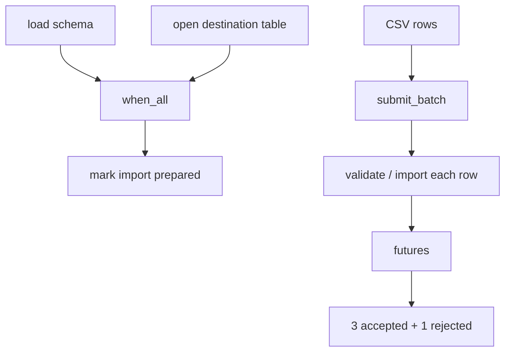

# Service Data Import

Executor's task model also applies to server workloads. Before importing CSV orders, this example loads a schema and opens a destination table in parallel. After preparation it validates/imports four rows concurrently, one of which is invalid. The request reports accepted and rejected counts, and service shutdown confirms that no work remains.

It intentionally does not connect to a real database, keeping the smoke test free of external dependencies. Real writes still need transactions, idempotency keys, and connection-pool capacity.

## Request stages



The schema/table relationship is a one-time completion dependency. The four rows are an independent batch, but each retains its own success or exception result. A batch is not a database transaction: failure of one item does not roll back completed siblings.

## Run the example

<<< @/../examples/tutorial/10_service_data_import.cpp{1-77}

```bash
cmake -B build -DCMAKE_BUILD_TYPE=Release \
  -DEXECUTOR_BUILD_TESTS=ON \
  -DEXECUTOR_BUILD_EXAMPLES=ON \
  -DEXECUTOR_ENABLE_GPU=OFF
cmake --build build --target tutorial_10_service_data_import
./build/examples/tutorial/tutorial_10_service_data_import
```

```text
prepared=yes, schema=schema-v1, table=orders
imported=3, rejected=1, callbacks=1, drained=yes
```

The stable facts are successful preparation, three valid rows, one invalid row, one observed task exception, and a drained default asynchronous executor. There are no thread IDs, times, or completion-order assertions.

## Prepare prerequisites

```cpp
auto schema = executor.submit_with_handle(load_schema);
auto destination = executor.submit_with_handle(open_table);
auto prerequisites = executor.when_all({schema.handle, destination.handle});
auto prepared = executor.submit_after(prerequisites, mark_prepared);
```

`TaskHandle` expresses completion only; obtain `schema-v1` and `orders` from their respective futures. Keep both handles and futures in the request owner until `prepared.get()` completes. Do not store them across Executor instances or request lifetimes.

If schema loading fails, the dependent does not run and its future propagates the prerequisite failure. Convert that failure to a clear 4xx/5xx or retry result at the request boundary rather than submitting rows anyway.

## Build an independent batch

Capture each row by value so a later mutation of `rows` cannot leave tasks with dangling references:

```cpp
for (const auto& row : rows) {
    imports.push_back([row, &imported] {
        validate_and_import(row);
        ++imported;
    });
}
auto futures = executor.submit_batch(imports);
```

The shared counter is atomic and outlives all futures. Do not let several tasks mutate one request-result object without synchronization. Prefer each future returning a `RowResult`, then aggregate in the request thread.

Partial success is intentional here: one missing order ID does not invalidate the other three rows. Consume every future:

```cpp
for (auto& future : futures) {
    try {
        future.get();
    } catch (const std::exception&) {
        ++rejected;
    }
}
```

Do not exit the loop at the first exception, or the remaining results become unobserved. For all-or-nothing behavior, parse and validate in parallel, then commit through a controlled database transaction; Executor batch does not provide rollback.

## Separate request results from service observation

| Observation | Owner | Question answered |
| --- | --- | --- |
| Per-row future | Current import request | Which row succeeded or failed, and what response follows? |
| Failure callback | Logging/alert adapter | Is the service seeing task-exception events? |
| Failure status | Health check/dashboard | How many failures of this kind have accumulated? |
| `WaitResult` | Lifecycle owner | How much active/queued work remains during stop? |

Keep callbacks short and non-blocking. Do not synchronously call a remote alert API from a worker failure path; hand the event to your own logging or telemetry queue.

## Capacity and production protocols

Four rows, two workers, and capacity `32` validate partial failure; they are not production parameters. For large CSVs, read in bounded row/byte chunks, cap in-flight batches, release input buffers and futures after each batch, match write concurrency to the database connection pool, and record queue time, batch age, rejection count, and end-to-end throughput.

Use an order/import ID as an idempotency key because a task can finish after a caller timeout and a batch can be retried. Use a transaction or staging-table switch for all-or-nothing writes. `wait_for_completion_ex()` cannot terminate an executing database call, so connections/statements need their own timeouts and long batches need a business deadline. If an HTTP request can disconnect first, persist a job ID, progress, and row errors instead of keeping futures only on the request stack.

## Failure injection and shutdown

Fail schema loading, preserve the empty order ID, make database work slow under a shorter request budget, and begin service draining before accepting a batch. Each path should produce an explicit preparation error, partial result, timeout policy, or submission rejection.

Stop new traffic, put HTTP into draining mode, stop readers/producers, let current requests consume futures, bounded-wait the executor, record pending counts/failures/unfinished job IDs, then shut down Executor before destroying the connection pool, result store, and log facilities. Rebuild an independent import subsystem rather than reinitializing a shut-down instance.

| New requirement | Evolution |
| --- | --- |
| Large file | Stream chunks and limit in-flight batches |
| All-or-nothing | Validate in parallel, then enter a database transaction |
| Background import | Persist job state and return `202 Accepted` |
| Retry failed rows | Add idempotency keys, retry limits, and dead-letter records |
| Multi-tenant shared executor | Add per-tenant rate/fairness controls |
| Order affects outcome | Partition serially by key or build explicit dependencies |

The same principle applies to the robot pipeline: define task relationships and data ownership first, use futures for individual results and callback/status for service observation, then let the application define overload, idempotency, and exit semantics.
