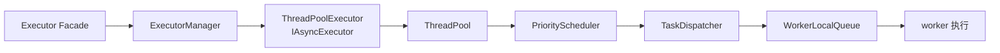
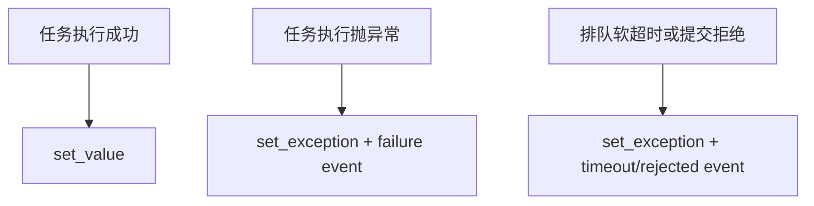
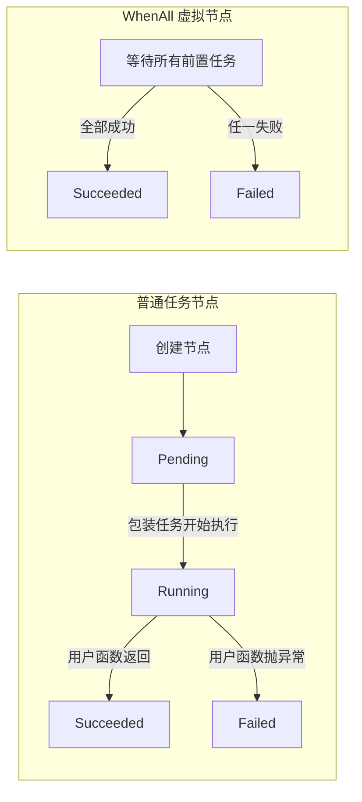
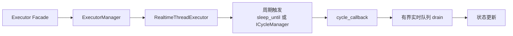

# 任务如何穿过执行器

## 学习目标

建立调试和性能分析所需的执行心智模型，同时把当前内部路径与稳定公开 API 明确区分。

## 普通任务路径



### 从 `submit()` 到 worker

1. `Executor::submit()` 先向默认 `IAsyncExecutor` 提交一个包装任务。包装任务兑现 `promise`，在用户函数抛异常时把异常写回 future，并把异常继续抛给底层执行器，使 future 与服务级 failure 观察保持一致。
2. 默认 manager 首次取得异步执行器时可用 `std::call_once` 进行懒初始化；显式初始化已经发生或 shutdown 后，Facade 将相应拒绝变成可诊断结果。
3. `ThreadPoolExecutor` 在自身 mutex 下取得一个 `shared_ptr<ThreadPool>` 快照，再把任务交给线程池。这一快照使 stop 与提交并发时，提交路径不会解引用已释放的线程池对象。
4. `ThreadPool` 把任务按 `CRITICAL → HIGH → NORMAL → LOW` 放入 `PriorityScheduler`。当前实现为四个优先级队列分别设置 mutex；优先级保证的是取队列顺序，不是运行中抢占。
5. `TaskDispatcher` 从调度器批量取任务，以 `LoadBalancer` 选择目标 worker，并推入该 worker 的本地队列。若 resize 使 worker ID 失效，或本地队列已满，任务会重新入调度器，而不是在“已出队、未入本地队列”的窗口静默丢失。
6. worker 先从自己的队列取任务；空闲时根据负载优先从负载更高的 worker 窃取，无法形成差异时才回退到随机起点。任务函数完成后，线程池更新完成/失败与耗时统计，并唤醒等待者。

Facade 负责 future、failure event、任务图和生命周期入口；manager 持有默认异步执行器及注册表；`ThreadPoolExecutor` 将公开异步接口映射到线程池。当前线程池从优先级调度器取任务，分发到 worker 本地队列，并结合负载信息尝试工作窃取。

### future 为什么一定要被兑现

`Executor::submit()` 没有直接使用底层线程池返回的 future。Facade 自己创建 `std::promise<return_type>`，再把用户 callable、promise 和失败记录逻辑包装成一个 `void()` 任务交给 `IAsyncExecutor`。这样所有后端都能提供一致的用户 future 和失败观察语义。

promise 有三条竞争路径：



`promise_ready` 原子标志负责 exactly-once 兑现：拒绝与 timeout callback 使用 compare-exchange 争夺兑现权，避免同一个 promise 被重复 `set_exception()`。任务正常路径在执行结束后发布 ready；异常路径先保存当前异常，再同时写入 future 和服务级 failure 记录，并继续向底层抛出，让线程池失败计数也能看到任务异常。

这解释了两个用户行为：

- 被拒绝或排队超时的 future 也必须变为就绪异常，不能永久阻塞调用方；
- `future.get()` 与 failure callback 可能观察同一次失败，但承担不同责任，前者属于单次结果，后者属于服务诊断。

### 任务图不是 worker 阻塞等待

`submit_with_handle()` 先在 Facade 的 `task_graph_nodes_` 创建 `Pending` 节点，再提交一个包装任务。包装任务开始时转为 `Running`，成功后转为 `Succeeded`，异常时转为 `Failed`。



`submit_after_with_handle()` 不应让 worker 在任务体里同步等待依赖。Facade 先验证 handle 是否属于当前任务图、用 `TaskDependencyManager` 增加有向边并做 DFS 环检测；依赖未完成时，提交包装逻辑等待图状态变为可运行或失败，再决定是否将真正工作交给异步执行器。前置失败会把同一个 `exception_ptr` 传播到 dependent future，不执行 dependent 用户函数。

`when_all()` 是一个没有用户任务体的虚拟图节点。它处于 `WhenAll` 状态，任一依赖完成时由 `resolve_task_graph_dependents_locked()` 重新检查：全部成功则完成，任一失败则失败，并继续唤醒下游节点。完成节点没有 dependents 时会裁剪依赖状态，避免常驻服务无限保存所有历史边。

图状态由 `task_graph_mutex_` 保护，依赖邻接表内部还有 `shared_mutex`。这不是为了让两个锁同时保护同一字段：外层保证节点状态与 dependents 解析的一致快照，内层封装依赖边和完成集合的读写。跨 Executor handle 无法在目标图中找到，因此被视为无效，而不是全局搜索。

### scheduler、dispatcher 与 worker 是三段路径

线程池提交时先构造内部 `Task`，记录 ID、priority、提交时间、软 timeout 和函数，再在生命周期锁下确认尚未停止，放入 `PriorityScheduler` 并增加 `total_tasks_`。释放生命周期锁后才 dispatch，避免持有 `mutex_` 时再进入 scheduler/local queue/load balancer 锁造成锁序反转。

`PriorityScheduler` 为四个等级维护独立 heap 和 mutex。dequeue 每次按 `CRITICAL → HIGH → NORMAL → LOW` 检查；同等级 heap 依赖 task 比较规则。这个模型只决定**尚未开始任务**的取出顺序，不能打断已经在 worker 上运行的低优先级函数，也没有跨等级公平配额，因此持续高等级流量可能使低等级任务饥饿。

`TaskDispatcher` 批量从全局 scheduler 取任务，再由 `LoadBalancer` 选择本地 worker queue。这里最重要的不是“选了哪一个 worker”，而是出队后的所有失败分支都必须可逆：

- resize 后 worker ID 越界：重新 enqueue；
- 本地 queue 满：重新 enqueue；
- 批量只成功 push 一部分：未 push 的逐项重新 enqueue；
- local queue vector 被替换：持 `shared_ptr` 快照延长旧 vector 生命周期。

worker 优先 pop 自己的本地队列；没有任务时才尝试从其他 worker steal。负载差异明确时优先窃取较忙 worker，否则从随机起点遍历，减少固定顺序热点。工作窃取改善平均利用率，但会降低“任务固定在哪个线程”的可预测性，因此线程本地业务状态不能假设 submitter 或固定 worker。

### 软超时在执行前判断

内部 `Task` 保存 `submit_time_ns` 和 `timeout_ms`。worker 真正开始执行前计算排队时间；若已经超过软 timeout，调用 `on_timeout` 兑现 future 异常并增加 timeout 计数，不运行用户函数。

这不是执行中 deadline。任务一旦开始，线程池不会从外部杀死 C++ 函数；业务函数仍需检查停止信号，并为网络、文件和设备 I/O 配置自己的超时。

### 同步点与不变量

当前普通线程池不是“全无锁”实现：优先级队列使用分级 mutex，默认 `WorkerLocalQueue` 的 push/pop/steal 使用 mutex，local-queue 向量与 resize 通过 `shared_mutex` 协调。这样做换取了 resize、回收与无任务丢失的清晰边界；启用的无锁 worker queue 也是可选实现路径，不能从公开 API 推断其必然存在。

等待完整性的核心不变量是：已接受任务最终要么执行并计入完成/失败，要么在拒绝/超时路径让其 future 成为就绪异常；dispatcher 的回入队逻辑正是为维护这一不变量。`wait_for_completion_ex()` 观察的是默认异步执行器的快照，不是全进程所有后台活动。

这些内部模块帮助解释“为什么队列堆积”或“为什么任务在另一 worker 执行”，但不是替代 `submit()`、`get_completion_status()` 和监控 API 的用户入口。

### 等待完成为什么检查四个条件

线程池的完成条件不是 `queue_size == 0`：dispatcher 可能已把任务移到本地队列，worker 也可能已 pop 后正在运行。因此 `is_completion_ready()` 同时要求：

```text
global scheduler empty
∧ all local queues empty
∧ active_threads == 0
∧ total_tasks == completed_tasks
```

`failed_tasks_` 是 completed 的失败子集，不额外加入等式。worker 用 RAII `ActiveCounter` 维护 active 数，即使 monitor callback 或执行包装发生异常，也不会漏掉 decrement 让等待永久卡住。

等待线程在循环中还会主动 `dispatch_pending_tasks(64)`。原因是 shutdown 已让某些 worker 观察到 stop，而 scheduler 中仍可能留有此前因本地队列竞争被回入队的任务；如果等待方只睡眠，完成将依赖一个已经退出分发路径的 worker。主动 dispatch 保证排空仍能推进。

状态查询仍是快照：scheduler/local queue/counter 不是在一个全局停顿点读取。完成判定通过循环和条件变量重新检查，而不是把单次状态快照当作同步原语。

## 实时任务路径



### 一个周期内发生什么

1. 内置周期源以 `sleep_until(next_cycle_time)` 驱动；若注入 `ICycleManager`，外部周期源负责触发同一轮 `cycle_loop()`。
2. 每轮先运行 `cycle_callback`。回调异常被异常处理器捕获，避免杀死周期线程；这不代表业务成功，应用仍需自己的失败观察协议。
3. 然后 `process_tasks()` 从 MPSC 队列最多取出 `max_tasks_per_cycle` 项，执行任务并归还包装对象。预算为 `0` 才表示不限；默认预算让突发生产不会在一个周期内无限 drain。
4. 统计更新使用原子计数、整数 EMA 和 CAS 更新最大周期时间；超过 `cycle_period_ns` 时增加 `cycle_timeout_count`。若下一计划时刻已经落后，循环重设为“现在加一个周期”，跳过错过节拍而不是零等待追赶。

### 接受、拒绝与停止竞态

`push_task_ex()` 先登记一个 in-flight producer，再检查 `running_`，从预分配池获得 wrapper，并尝试入 MPSC 队列。空任务、未运行、对象池耗尽和队列满分别累加可见拒绝计数。停止路径先禁止新生产、等待已登记 producer 退出，再让单消费者 drain，目标是不让“已接受任务”在最终 drain 之后凭空出现。

队列本身是有界 MPSC 无锁队列，但这不意味着整条实时路径没有锁或分配：当前 `ObjectPool` 为避免 ABA、外来指针和重复释放，用 mutex 保护 free list；用户 callback、异常处理器和外部 `ICycleManager` 也可能引入锁、系统调用或分配。因此文档中的“避免锁、无限等待与运行期分配”是实时设计目标和调用方约束，不是对当前每条内部指令的绝对承诺。真实周期预算必须以 trace、状态和目标平台测量验证。

## 关闭与状态

普通 `wait_for_completion_ex()` 只等待默认异步执行器，不能证明实时 callback 或实时队列已经完成。实时流水线需要自己的确认、阶段门或停止顺序。状态 API 是当前运行情况的快照；调试内部路径时应以它们和 failure/comm events 为证据，而不是依赖线程调度偶然顺序。

### stop 与提交如何避免悬空对象

`ThreadPoolExecutor` 在 mutex 下把内部 `shared_ptr<ThreadPool>` 复制到局部变量。submit 和 status 使用局部快照；stop 则先从 adapter 清空成员指针，再对自己的局部 `shared_ptr` 调 shutdown。这样并发提交要么在清空前取得仍存活的 pool，要么看到空指针并拒绝，不会解引用已经析构的对象。

快速停止 `stop(false)` 会把局部 pool 移入一个分离线程执行 shutdown，避免调用方阻塞；这只解决资源回收位置，不会强制中断正在运行的用户函数，也不会替业务数据定义恢复语义。

## 实现说明，不是承诺

路径中的 `ThreadPool`、`PriorityScheduler`、`TaskDispatcher`、worker 队列与实际窃取策略可能在不改变公开行为的版本中重构。把它们当作“当前发生什么”的说明，而不是可以直接调用的 API。

对应源码入口：[`src/executor/executor.cpp`](https://github.com/Linductor-alkaid/executor/blob/master/src/executor/executor.cpp)、[`src/executor/executor_manager.cpp`](https://github.com/Linductor-alkaid/executor/blob/master/src/executor/executor_manager.cpp)、[`src/executor/thread_pool/thread_pool.cpp`](https://github.com/Linductor-alkaid/executor/blob/master/src/executor/thread_pool/thread_pool.cpp)、[`src/executor/thread_pool/task_dispatcher.hpp`](https://github.com/Linductor-alkaid/executor/blob/master/src/executor/thread_pool/task_dispatcher.hpp) 与 [`src/executor/realtime_thread_executor.cpp`](https://github.com/Linductor-alkaid/executor/blob/master/src/executor/realtime_thread_executor.cpp)。阅读源码时请同时参考测试：它们描述外部可依赖的行为，而不是由本文固定内部结构。

## 下一步阅读

先用[源码架构与阅读地图](/zh/advanced/source-architecture)定位同步域；需要高频单消费者任务聚合时阅读[无锁与性能实验](/zh/advanced/lockfree-and-performance)。
