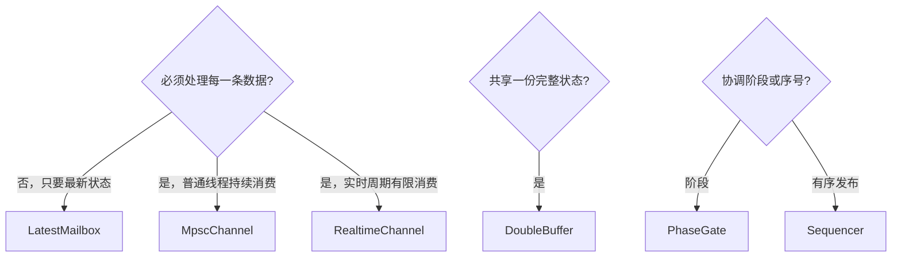

# 如何选择通信组件

先问数据允许怎样丢失或覆盖，而不是先问哪种队列更快。以下组件都用于跨线程协调，但它们表达的业务语义不同。

| 数据语义 | 默认组件 | 需要观察 |
| --- | --- | --- |
| 只需要最新配置或目标值 | `LatestMailbox<T>` | sequence、是否读取到新值、覆盖次数和 stale。 |
| 每条消息都必须按 FIFO 消费 | `MpscChannel<T>` | 容量、drop policy、close 与 timeout。 |
| 周期内只消费有限消息 | `RealtimeChannel<T>` | 不等待 condition variable、单周期预算、drop 与 handler 异常；内部由 mutex 保护。 |
| 多个读者需要完整一致的状态 | `DoubleBuffer<T>` | sequence、新旧值判断、单写多读边界。 |
| 初始化、标定、运行必须按阶段推进 | `PhaseGate` | timeout、close、phase 倒退与 missed phase。 |
| 需要严格有序发布 | `Sequencer` | 等待超时、关闭和遗漏序号。 |

## 容量与背压

容量不是实现细节，而是系统的失压阀。对 `MpscChannel` 与 `RealtimeChannel`，先明确满队列时是阻塞、拒绝、丢最新还是丢最旧；对 `LatestMailbox`，旧值被覆盖正是设计语义。生产者必须根据返回值、统计或事件 callback 观察这些结果，不能假设消息一定到达。

## close、超时与陈旧数据

`close` 表示不再接受或产生新数据，不等于已经处理完历史消息。timeout 表示在给定期限内没有满足操作；stale 表示值仍存在但不再新鲜。三者都应在业务协议中单独处理，尤其不要把“读取到旧配置”误判为“收到新配置”。

## 观察边界

通信组件的 `CommStats` 与 `CommEventCallback` 报告 drop、overwrite、stale、latency、lag 和 missed phase。它们默认不计入 `ExecutorFailureStatus`，也不会调用 `Executor::set_failure_callback()`；需要统一告警时，在组件 callback 中桥接到你的监控系统。

`RealtimeChannel` 与 `DoubleBuffer` 当前内部使用 mutex：前者表达有界周期消费，后者表达完整的按值快照；两者都不构成无锁或硬实时保证。

## 下一步阅读

先看这些组件如何连接成[完整机器人数据流水线](/zh/tutorial/complete-robot-pipeline)，再用[容量判断与告警落地](/zh/realtime-and-communication/capacity-and-alerting)把数据语义转换成窗口指标与过载动作。普通后台任务的选择请看[如何选择提交接口](/zh/guides/choosing-submit-api)。
