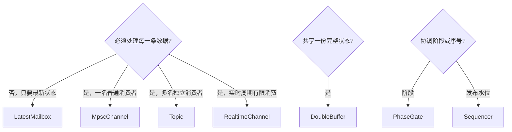

# 如何选择通信组件

先问数据允许怎样丢失或覆盖，而不是先问哪种队列更快。以下组件都用于跨线程协调，但它们表达的业务语义不同。

| 数据语义 | 默认组件 | 需要观察 |
| --- | --- | --- |
| 只需要最新配置或目标值 | `LatestMailbox<T>` | sequence、是否读取到新值、覆盖次数和 stale。 |
| 每条消息由一名消费者按 FIFO 处理 | `MpscChannel<T>` | 容量、drop policy、close 与 timeout。 |
| 多个独立模块各自接收同一后续事件流 | `Topic<T>` | 每订阅者容量、drop policy、关闭、drop 与 lag。 |
| 周期内只消费有限消息 | `RealtimeChannel<T>` | 预分配 MPSC 存储、单逻辑消费者、单周期预算、drop 与 handler 异常。 |
| 多个读者需要完整一致的状态 | `DoubleBuffer<T>` | 四个 reader-pin 槽、四次尝试的 `try_load()`、lock-free `try_publish()`、sequence 与 SWMR 边界。 |
| 初始化、标定、运行必须按阶段推进 | `PhaseGate` | timeout、close、phase 倒退与 missed phase。 |
| 相位 N 的完整值必须在 N+1 才可见 | 将 `DoubleBuffer<T>` 或 `LatestMailbox<T>` 绑定到 `PhaseGate` | `CommResult`、每相位一次发布、是否缺少上一相位值。 |
| 单调 publication watermark 可以跳过 ticket | `Sequencer` | 水位是否达到、精确等待超时、关闭和被越过 ticket。 |

```mermaid
flowchart TD
    A{必须处理每一条数据?}
    A -- 否，只要最新状态 --> B[LatestMailbox]
    A -- 是，一名普通消费者 --> C[MpscChannel]
    A -- 是，多名独立消费者 --> T[Topic]
    A -- 是，实时周期有限消费 --> D[RealtimeChannel]
    E{共享一份完整状态?}
    E -- 是 --> F[DoubleBuffer]
    G{协调阶段或序号?}
    G -- 阶段 --> H[PhaseGate]
    G -- 发布水位 --> I[Sequencer]
```

## 容量与背压

容量不是实现细节，而是系统的失压阀。对 `MpscChannel` 与 `RealtimeChannel`，先明确满队列时是重试到 timeout、拒绝最新值、丢弃最旧值还是只保留最新值；`Topic` 把 drop 选择独立应用到每个 subscription，一个慢订阅者不会阻塞其他订阅者，但 publisher 必须检查 `TopicPublishResult` 并分别观察订阅统计。对 `LatestMailbox`，旧值被覆盖正是设计语义。生产者不能假设消息一定到达。

## close、超时与陈旧数据

`close` 表示不再接受或产生新数据，不等于已经处理完历史消息。timeout 表示在给定期限内没有满足操作；stale 表示值仍存在但不再新鲜。三者都应在业务协议中单独处理，尤其不要把“读取到旧配置”误判为“收到新配置”。

## 观察边界

通信组件的 `CommStats` 与 `CommEventCallback` 报告 drop、overwrite、stale、latency、lag 和 missed phase。它们默认不计入 `ExecutorFailureStatus`，也不会调用 `Executor::set_failure_callback()`；需要统一告警时，在组件 callback 中桥接到你的监控系统。

`MpscChannel` 与 `RealtimeChannel` 在构造期预分配有界 MPSC 节点，并限定一个逻辑消费者。`LatestMailbox` 与未绑定的 `DoubleBuffer` 使用四个固定 reader-pin 槽，reader 复制非平凡 `T` 时 writer 不会改写同一槽。`PhaseGate` 与 `Sequencer` 使用非阻塞原子状态核心。这些原语会在平台所需同步原子不是 lock-free 时拒绝构造。

应分别理解不同保证：data-race-free 表示并发访问在 C++ 中有效；`is_synchronization_lock_free()` 只描述内部同步原子；内部存储预分配不代表 `T` 内部不分配；这些事实都不能单独证明硬实时。快照 `try_load()` 最多检查四个槽。快照 `try_publish()` 是非等待、系统级 lock-free，但竞争中的 CAS 可重试，所以既不承诺单次调用有界，也不是 wait-free。payload 操作、时钟、字符串/结果、callback、缺页与 OS 调度都不在保证内。`publish()`、`load()`、`send_for()`、`receive_for()` 和阶段 wait 等保证成功/等待超时的兼容 API 可能 spin/yield，实时路径必须选择合适的非等待接口并实测周期预算。callback 配置与执行属于控制面诊断。

快照 sequence 是有限域（最后一个值为 `2^56 - 1`）：耗尽时 `try_publish()` 返回 `false`，重试型 publish/update 兼容 API 抛 `std::overflow_error`。phase/ticket 状态必须小于 `2^63`，非法 wait 在轮询前返回 `InvalidArgument`。相位绑定 LET 发布的边界更紧，为 `phase < 2^63 - 1`，因为双槽状态把最大值保留为空态哨兵。

`Sequencer` 是 publication watermark，而不是严格 ticket 队列。`publish(ticket)` 可以跳过中间 ticket；`is_published(ticket)` 表示水位已达到或越过它。精确的 `wait_until_published()` 只在相等时成功，水位越过目标后返回 `MissedPhase`。

相位绑定单值时，应对 `DoubleBuffer` 或 `LatestMailbox` 显式调用 `bind_to_phase_gate()`；该 LET 模式是固定双槽 SWSR，不是 FIFO `RealtimeChannel` 的替代品。

`Topic` 仍使用 mutex，并为订阅 registry 和每次 publish fan-out 的订阅快照动态分配；复制与 fan-out 时间也随订阅数增长。整个 Topic 路径（包括 `publish()`）只提供进程内、无重放的 best-effort 事件分发，不用于硬实时周期，也不替代提供持久化、确认和重连的网络消息系统。大型不可变负载可显式选择 `Topic<std::shared_ptr<const T>>`。

## 下一步阅读

先看这些组件如何连接成[完整机器人数据流水线](/zh/tutorial/complete-robot-pipeline)，再用[容量判断与告警落地](/zh/realtime-and-communication/capacity-and-alerting)把数据语义转换成窗口指标与过载动作。普通后台任务的选择请看[如何选择提交接口](/zh/guides/choosing-submit-api)。
