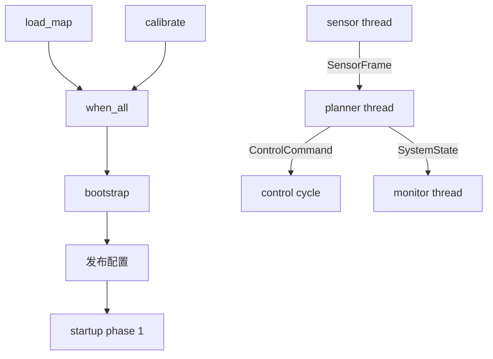
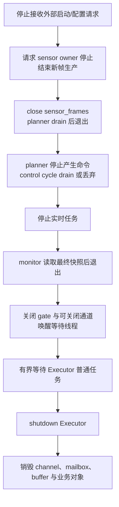

# 完整机器人数据流水线

前面的教程分别回答了“如何提交”“如何表达依赖”和“如何在线程间传值”。真实系统需要把这些选择组合起来，并为每条边定义所有权、容量、失败和关闭语义。本页以仓库中的 `comm_robot_pipeline` 为事实源，解释一条传感器采集、规划、控制和监控流水线为什么这样连接，以及从教学示例走向生产还缺什么。

## 这次要构建什么

系统有四个长期角色和两个启动任务：



这张图刻意区分两类关系：

- **完成依赖**：地图与标定必须成功，启动阶段才能推进，使用 Executor 任务和 `TaskHandle`。
- **持续数据流**：启动后各角色长期交换帧、配置、命令和状态，使用 `executor::comm`。

任务依赖不适合替代消息流；消息通道也不适合表达“一次初始化成功后才允许启动”的计算结果。

## 先定义业务对象与数据所有权

| 数据 | 生产者 | 消费者 | 所有权策略 |
| --- | --- | --- | --- |
| `SensorFrame` | sensor thread | planner thread | 按值进入有界队列，消费后出队 |
| `ControlConfig` | bootstrap/配置 owner | planner/control | mailbox 保留一份最新值，读取时复制 |
| `ControlCommand` | planner thread | control cycle | 按值入有界实时通道，每周期有限消费 |
| `SystemState` | planner thread | monitor thread | writer 发布完整对象，reader 获得快照副本 |
| startup phase | bootstrap | 所有长期角色 | 单调阶段号，不携带业务数据 |

示例结构体都很小，按值传递能把生命周期说清楚。生产中的图像、点云或大型模型不应未经测量直接复制；可在消息中传递具有明确所有权的 buffer handle，但仍要定义池容量、归还时机和关闭后的释放责任。

## 为什么每条边使用不同组件

### 帧流：`MpscChannel<SensorFrame>`

传感器帧按 FIFO 到达规划线程，示例容量为 `16`。这里使用 channel 而不是共享 `vector + mutex`，因为生产者需要知道队列是否满，消费者需要通过 `close()` 区分“暂时没有数据”和“以后不会再有数据”。

```cpp
executor::comm::ChannelOptions frame_options;
frame_options.capacity = 16;
frame_options.name = "sensor_frames";

executor::comm::MpscChannel<SensorFrame> sensor_frames(frame_options);
```

示例生产者在 `try_send()` 失败时不断 `yield()`，目的是让八帧演示最终全部到达。生产代码不能照搬无限重试：应选择 `send_for()` 的时间预算、上游降频、明确 drop policy，或在停止信号到来时退出重试。

### 配置：`LatestMailbox<ControlConfig>`

控制增益只关心当前版本，旧配置没有排队价值。mailbox 用 sequence 区分是否出现新版本；覆盖旧值是预期语义，不等同于消息队列丢失。

示例每次以基准 sequence `0` 读取当前已发布配置，足以演示初始化后的稳定配置。长期配置消费者应保存自己的 `last_seen`，只有 sequence 增长时才重新应用配置，并决定启动时没有配置该使用默认值、阻塞还是拒绝运行。

### 控制命令：`RealtimeChannel<ControlCommand>`

规划可能一次产生多条命令，但控制周期不能为了清空积压而无限工作：

```cpp
executor::comm::RealtimeChannelOptions command_options;
command_options.capacity = 8;
command_options.max_items_per_cycle = 2;
command_options.name = "control_commands";
```

`drain_for_cycle()` 每轮最多处理两条，剩余命令保留到后续周期。这个预算保护周期长度，却也意味着生产者必须观察 `try_send()` 失败、队列深度、lag 和命令年龄。对于“旧命令一旦有新命令就失效”的控制协议，FIFO 甚至可能不是正确模型，应改用 mailbox 或应用级命令合并。

### 状态：`DoubleBuffer<SystemState>`

监控线程需要完整一致的速度、油门和帧号，不需要处理每次中间变化。planner 是唯一 writer，先构造完整 `SystemState` 再发布；monitor 读取带 sequence 的值副本，不会看到字段更新到一半的对象。

多 writer 不能未经协调同时发布。若状态来自多个模块，应先汇聚到单一 state owner，或为各责任域建立独立快照。

### 启动：`PhaseGate`

传感器、规划、控制和监控都等待 phase `1`。只有地图与标定任务汇合、配置发布后，bootstrap 才推进阶段：

```mermaid
flowchart TD
    A[地图成功 + 标定成功] --> B[发布初始 ControlConfig]
    B --> C[startup.advance_to(1)]
    C --> D[长期角色开始工作]
```

阶段号只表达单调状态，不携带配置内容，也不会自动回滚。需要重启整条流水线时，通常重建 gate 与相关组件，而不是尝试把 phase 从运行倒退到初始化。

## 启动依赖如何进入流水线

示例使用两个带句柄的普通任务，再通过 `when_all()` 汇合：

```cpp
auto load_map = executor.submit_with_handle(load_map_task);
auto calibrate = executor.submit_with_handle(calibrate_task);
auto prerequisites = executor.when_all({load_map.handle, calibrate.handle});
auto bootstrap = executor.submit_after(prerequisites, start_pipeline);
```

这样做的价值是前置失败会传播到 bootstrap future，且依赖关系可见。它不是大规模非阻塞 DAG 调度器：当前 dependent wrapper 仍可能在线程池中等待前置状态。示例固定两个 worker、先提交前置再提交 dependent；生产中仍应限制在途依赖链，并在最小线程数下压测。

启动调用方必须消费 `bootstrap.get()`。若地图或标定失败，应关闭 gate/通道、唤醒等待角色并进入失败清理，不能只是不推进 phase 后让线程等待到超时。

## 并发假设必须写出来

本示例依赖以下假设：

- `sensor_frames` 可以有多个生产者，但只有 planner 一个消费者。
- `control_config` 可以被更新覆盖，消费者只关心最新完整值。
- `control_commands` 由 planner 生产，由一个周期角色 drain。
- `system_state` 只有 planner 一个 writer，可以有监控读者。
- `planner_done` 只表示 planner 不再生产命令；它不表示命令通道已经清空。
- 所有线程对象和通信组件都活到四个线程 join 完成之后。

改变任何一项都可能需要换组件。例如增加第二个 planner 消费同一帧，不是简单增加一个 `receive_for()` 线程：channel 的一条消息只会被一个消费者取走。两个模块都要看到每帧时，需要 fan-out、复制或发布订阅设计。

## 构建和运行完整示例

基础构建不需要 GPU、实时权限或专用硬件：

```bash
cmake -B build -DCMAKE_BUILD_TYPE=Release \
  -DEXECUTOR_BUILD_EXAMPLES=ON \
  -DEXECUTOR_ENABLE_GPU=OFF
cmake --build build --target comm_robot_pipeline
./build/examples/comm_robot_pipeline
```

完整源码：[`examples/comm_robot_pipeline.cpp`](https://github.com/Linductor-alkaid/executor/blob/master/examples/comm_robot_pipeline.cpp)。

输出中的 `[rt]` 与 `[monitor]` 行会因线程调度交错，延迟数值也依赖机器；不要用固定全文做测试。应核对以下稳定事实：

- bootstrap 输出同时包含地图和标定完成；
- 控制侧最终处理已接受的命令；
- 五个组件都能输出统计快照；
- 正常路径中帧通道和命令通道没有意外 drop；
- 所有线程 join 后进程正常结束。

monitor 可能在 planner 发布首个快照前先轮询一次，因此出现 `[comm] system_state: StaleRead` 是这个示例可解释的初始状态；它不表示快照损坏。多线程同时写 `std::cout` 时，局部文本也可能交错。生产日志应使用线程安全 sink，并用组件名、sequence 和业务 ID 结构化关联事件。

## 这个示例没有承诺什么

### 它不是实时性能证明

名为 `realtime_thread` 的角色使用普通 `std::thread + sleep_for(1ms)` 模拟周期消费，便于在任何开发机运行。它没有调用 `register_realtime_task_ex()`，也没有验证实时优先级、CPU affinity、内存锁、timer slack 或 jitter。

真实部署应把周期角色替换为[专用实时任务 Facade](/zh/realtime-and-communication/realtime-control)，但可以保留 `RealtimeChannel` 的有界消费语义。替换后要以 `RealtimeExecutorStatus` 和目标硬件测量验证，而不是沿用示例 sleep 周期。

### 它不是完整的故障恢复实现

为了保持示例短小，代码没有完整处理初始化失败、启动依赖失败、传感器永久背压、控制命令拒绝或线程中异常。生产入口优先使用 `initialize_ex()`，每次 `try_send()` 都必须有业务动作，长期线程函数也应在边界捕获异常并触发统一停止。

### 它不是停机协议模板

示例依靠有限八帧自然结束。长期服务不能等待“数据自己发完”，必须有显式停止信号、通道 close owner 和超时预算。

## 从正常示例演进到生产形态

| 需求变化 | 需要增加的设计 |
| --- | --- |
| 传感器永久运行 | `std::jthread`/设备停止接口、有限 `send_for()`、close owner |
| 配置持续更新 | 独立 config owner、保存 `last_seen`、配置校验与回滚策略 |
| 控制循环有 jitter 预算 | 实时 Facade、状态字段核验、周期与单周期任务预算 |
| 命令过时不可执行 | deadline/sequence 校验、KeepLatest 或业务合并策略 |
| 多个监控消费者 | 明确快照复制成本和每个 reader 的 sequence |
| 任一角色失败要全局停止 | `request_stop()`、关闭全部 channel/gate、保存首个失败原因 |
| 需要重启流水线 | 重建独立 Executor/通信组件和业务状态，不复用已 shutdown 实例 |

## 故障注入：验证协议而不是只看正常输出

### 1. 帧消费者变慢

在 planner 每次消费后增加延迟，并把 `sensor_frames` 容量降到 `1`。预期不是“仍然毫无变化”，而是生产者按既定策略超时、拒绝或退避，`current_depth` / `peak_depth` / `dropped_count` 与业务日志能解释发生了什么。

### 2. 启动任务抛异常

让 `load_map` 抛出异常。预期 bootstrap future 失败，phase 不推进；应用随后应关闭 gate 和通道，使长期角色立即退出，而不是各自等待一秒后静默返回。

### 3. 控制消费者跟不上

把每周期预算降为 `1` 并提高命令生产速率。观察 `try_send()` 返回、drop、producer/consumer lag 和最大延迟。若旧命令已无业务价值，应改变数据策略，而不是只扩大容量。

### 4. 监控线程停止读取

暂停 monitor。planner 应继续运行，因为状态是快照而不是阻塞队列；`stale_read_count` 或 reader 的 sequence 能说明监控没有看到新版本。若 planner 被监控拖慢，说明职责错误耦合。

### 5. 关闭期间继续生产

先设置全局 draining，再关闭传感器通道，同时让生产者尝试发送。预期得到 `Closed`/false 和 `closed_send_count`，而不是访问已销毁 channel。

## 推荐的长期服务退出顺序



若退出预算耗尽，记录各 channel 深度、实时队列状态、Executor pending 快照和首个失败原因，再执行预先决定的快速关闭策略。超时本身不会安全终止任意业务函数。

## 一次架构评审应得到的结论

完成本案例后，你应该能明确回答：

1. 哪些工作是一次性任务，哪些是长期角色，哪些需要实时线程？
2. 每条数据边是否允许丢失、覆盖、超时或读取旧值？
3. 每个 channel、mailbox、buffer 和 gate 的 owner 是谁？
4. 哪个返回值、future、统计或事件能观察每类失败？
5. 上游持续过载时系统在哪里限流或降级？
6. 关闭顺序如何保证任务捕获的数据比任务活得更久？

下一步可按组件深入[实时与通信](/zh/realtime-and-communication/)，或用[生产接入检查清单](/zh/guides/production-readiness)把这条流水线映射到自己的项目。
